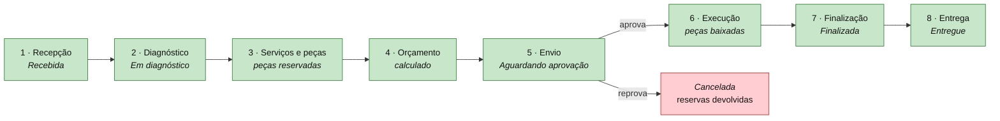

# AutoMecanic

**Sistema Integrado de Atendimento e Execução de Serviços** — back-end de gestão para uma
oficina mecânica de médio porte.

> Tech Challenge · Fase 1 — Pós-Tech FIAP, turma 15SOAT

[](https://dotnet.microsoft.com/)
[](https://www.postgresql.org/)
[]()
[]()
[]()

---

## O problema

A oficina controlava atendimento, diagnóstico, execução e entrega em **anotações manuais e
planilhas**. O resultado eram cinco problemas concretos, e o sistema responde a cada um deles:

| Problema relatado | Como o sistema resolve |
|---|---|
| Erros na priorização dos atendimentos | Máquina de estados explícita da OS + painel operacional por situação |
| Falhas no controle de peças e insumos | Saldo decomposto em **físico / reservado / disponível**, com razão *append-only* |
| Dificuldade em acompanhar o status dos serviços | Status muda automaticamente por ação, com linha do tempo e consulta pública para o cliente |
| Perda de histórico de clientes e veículos | Cadastros são **inativados, nunca excluídos**; toda OS permanece rastreável |
| Ineficiência no fluxo de orçamentos e autorizações | Orçamento **calculado automaticamente**, com validade, aprovação e reprovação registradas |

---

## Subindo o ambiente

**Pré-requisito único:** Docker com Compose. Nada mais precisa estar instalado.

```bash
git clone <url-do-repositorio> && cd AutoMecanic
cp .env.example .env
```

Edite o `.env` — os três valores marcados precisam ser trocados:

```bash
POSTGRES_PASSWORD=<uma senha forte>
JWT_CHAVE=<32+ caracteres; gere com: openssl rand -base64 48>
SEED_SENHA_ADMIN=<senha do admin: 8+ caracteres, maiúscula, minúscula, dígito e símbolo>
```

Suba tudo:

```bash
docker compose up -d --build
```

Pronto. O banco é criado, as migrações são aplicadas e a carga inicial é semeada
automaticamente.

| Recurso | Endereço |
|---|---|
| **Documentação interativa (Swagger)** | http://localhost:8080/swagger |
| Prontidão (verifica o banco) | http://localhost:8080/health/pronto |
| Vivacidade (só o processo) | http://localhost:8080/health/vivo |

### Primeiro acesso

```bash
curl -X POST http://localhost:8080/api/v1/autenticacao/login \
  -H "Content-Type: application/json" \
  -d '{"email":"admin@automecanic.com.br","senha":"<SEED_SENHA_ADMIN>"}'
```

Copie o `token` da resposta e informe-o no botão **Authorize** do Swagger.

Com `SEED_DEMO=true` (padrão), o ambiente já vem com **10 serviços**, **12 peças** e
**3 clientes com veículos** para exercitar os fluxos imediatamente.

### Encerrando

```bash
docker compose down       # para os contêineres, preserva os dados
docker compose down -v    # remove também o volume do banco
```

---

## Experimentando o fluxo completo

Os oito passos abaixo percorrem o ciclo de vida inteiro de uma Ordem de Serviço. Todos estão
prontos para executar no Swagger.



**1 · Recepção** — identifica o cliente pelo CPF/CNPJ, localiza ou cadastra o veículo pela
placa e abre a OS, tudo em uma chamada:

```http
POST /api/v1/ordens-servico/recepcao
{
  "documentoCliente": "111.444.777-35",
  "nomeCliente": "Carlos Andrade",
  "emailCliente": "carlos@exemplo.com.br",
  "telefoneCliente": "(11) 91234-5678",
  "placa": "JKL5M67",
  "marca": "Toyota", "modelo": "Corolla",
  "anoFabricacao": 2021, "anoModelo": 2022,
  "descricaoProblema": "Ruído metálico ao frear em baixa velocidade.",
  "quilometragemEntrada": 42000
}
```

**2 ·** `POST /api/v1/ordens-servico/{id}/diagnostico/iniciar`, depois
`POST .../diagnostico` com o laudo.

**3 ·** `POST .../servicos` e `POST .../pecas` — **a peça é reservada no estoque na mesma
transação**. Consulte `GET /api/v1/pecas/{id}` e veja o disponível cair sem o saldo físico mudar.

**4 ·** `POST .../orcamento` com `{"percentualDesconto": 10}` — o valor é calculado, nunca informado.

**5 ·** `POST .../orcamento/enviar`. **A partir daqui os itens ficam congelados** — tente
adicionar um serviço e receba `422`.

**6 ·** `POST .../orcamento/aprovar` → a OS vai para *Em execução* e as peças são **baixadas
do estoque**. Ou `POST .../orcamento/reprovar` → a OS é cancelada e as **reservas voltam**.

**7 ·** `POST .../finalizar` — a duração real passa a alimentar o indicador de tempo médio.

**8 ·** `POST .../entregar` — estado terminal. Qualquer nova ação recebe `422`.

Todas as requisições acima estão prontas em **[`AutoMecanic.http`](AutoMecanic.http)** — abra
no VS Code com a extensão *REST Client* e clique em *Send Request*.

**Acompanhamento pelo cliente**, sem autenticação:

```http
GET /api/v1/acompanhamento?numero=OS-2026-000001&documento=11144477735
```

---

## Documentação

| Documento | Conteúdo |
|---|---|
| [Visão geral](docs/00-visao-geral.md) | Índice e mapa de leitura |
| [Linguagem Ubíqua](docs/01-linguagem-ubiqua.md) | Vocabulário do negócio e sua tradução para o código |
| [Event Storming](docs/02-event-storming.md) | Os quatro fluxos completos, com comandos, eventos, políticas e hotspots |
| [Context Map](docs/03-context-map.md) | Contextos delimitados e a natureza de cada relacionamento |
| [Modelo de Domínio](docs/04-modelo-de-dominio.md) | Agregados, entidades, objetos de valor e invariantes |
| [Arquitetura](docs/05-arquitetura.md) | Camadas e as decisões técnicas, com seus custos |
| [Relatório de segurança](docs/06-relatorio-de-seguranca.md) | Análise de vulnerabilidades e OWASP API Top 10 |
| [Roteiro do vídeo](docs/07-roteiro-do-video.md) | Demonstração de 15 minutos, passo a passo |
| [Documento de entrega](docs/ENTREGA.md) | Modelo para exportação em PDF |

---

## Arquitetura

Monolito em camadas, com a **regra de dependência apontando para dentro**:

```
📡 Api             controladores, middlewares, Swagger, JWT
        ↓
⚙️  Application     casos de uso, DTOs, validadores, portas
        ↓
💎 Domain          agregados, objetos de valor, eventos      ← zero dependências
        ↑
🔌 Infrastructure  EF Core, PostgreSQL, BCrypt, JWT           ← implementa as portas
```

O **Domínio não tem um único pacote NuGet**. Suas 439 verificações rodam em 3 segundos, sem
banco e sem configuração.

### Escolhas técnicas

| Decisão | Justificativa resumida |
|---|---|
| **PostgreSQL 17** | Licença livre; `xmin` nativo para concorrência otimista; `INSERT … ON CONFLICT … RETURNING` para numeração atômica; imagem de 90 MB. [Detalhamento](docs/05-arquitetura.md#adr-01--postgresql-como-banco-de-dados) |
| **Serviços de aplicação**, não CQRS | O requisito pede camadas. Um mediador acrescentaria uma classe por operação sem resolver problema real |
| **Reserva de estoque** | Baixar na inclusão sumiria com peça de orçamento reprovado; baixar só na aprovação deixaria duas OS venderem a mesma peça |
| **Eventos antes do commit** | Torna atômico o par saldo + lançamento no razão |
| **Testcontainers** | Conversores de VO, `CHECK`, `xmin` e `ILIKE` não existem fora do PostgreSQL |
| **Imagem *chiseled*** | 8 pacotes de SO em vez de ~90; sem shell nem gerenciador de pacotes |

---

## Testes e qualidade

```bash
dotnet test                                             # 486 verificações
dotnet test tests/AutoMecanic.UnitTests                 # 439, ~3 s, sem I/O
dotnet test tests/AutoMecanic.IntegrationTests          # 47, PostgreSQL real
```

Relatório de cobertura:

```bash
dotnet test --collect:"XPlat Code Coverage" --settings coverlet.runsettings --results-directory TestResults
dotnet tool restore
dotnet reportgenerator -reports:"TestResults/*/coverage.cobertura.xml" -targetdir:coverage -reporttypes:Html
```

| Camada | Cobertura de linhas |
|---|---:|
| **Application** | **97,1%** |
| **Domain** | **90,9%** |
| Api | 89,6% |
| Infrastructure | 88,4% |
| **Total** | **92,2%** |

Os testes de integração sobem um **PostgreSQL real** via Testcontainers e exercitam a API
completa — autenticação, autorização por perfil, o fluxo inteiro da OS e a coordenação com o
estoque. Foram eles que encontraram os três defeitos descritos no
[relatório de segurança](docs/06-relatorio-de-seguranca.md#6-defeitos-encontrados-e-corrigidos-durante-o-desenvolvimento).

---

## Segurança

| Controle | Implementação |
|---|---|
| Autenticação | JWT HMAC-SHA256, validade de 60 min, sem tolerância de relógio |
| Senhas | BCrypt com fator de custo 12, salt por hash |
| Força bruta | Bloqueio de 15 min após 5 tentativas; limite de 10 logins/min por origem |
| Enumeração de contas | Resposta idêntica para e-mail inexistente e senha errada |
| Autorização | Políticas por capacidade de negócio, não por cargo |
| Dados sensíveis | CPF/CNPJ e placa validados por dígito verificador e formato |
| Exposição de dados | Nenhum agregado é serializado; toda resposta passa por DTO |
| Consumo de recursos | Limite de taxa global e página máxima de 100 itens |
| Contêiner | Imagem *chiseled*, usuário sem privilégios, `no-new-privileges` |

**Resultado da varredura:** 0 vulnerabilidades críticas ou altas; 0 no código e nas
dependências .NET. [Relatório completo](docs/06-relatorio-de-seguranca.md).

---

## Desenvolvimento local (sem Docker para a API)

```bash
# Apenas o banco em contêiner
docker compose up -d banco

# A API em execução local, no perfil de desenvolvimento
dotnet run --project src/AutoMecanic.Api
```

O perfil `Development` já traz cadeia de conexão, chave JWT de desenvolvimento e senha de
administrador em `appsettings.Development.json` — **nenhum desses valores serve para produção**.

### Migrações

```bash
dotnet tool restore

dotnet dotnet-ef migrations add <Nome> \
  --project src/AutoMecanic.Infrastructure \
  --startup-project src/AutoMecanic.Infrastructure \
  --output-dir Persistencia/Migracoes

dotnet dotnet-ef database update \
  --project src/AutoMecanic.Infrastructure \
  --startup-project src/AutoMecanic.Infrastructure
```

---

## Configuração

Todos os valores abaixo são lidos de variáveis de ambiente (duplo sublinhado separa os níveis).

| Variável | Padrão | Descrição |
|---|---|---|
| `ConnectionStrings__PostgreSQL` | — | **Obrigatória.** Cadeia de conexão |
| `Jwt__ChaveDeAssinatura` | — | **Obrigatória.** 32+ caracteres; a aplicação recusa iniciar sem ela |
| `Jwt__Emissor` · `Jwt__Audiencia` | `AutoMecanic.Api` · `AutoMecanic.Clientes` | Emissor e audiência do token |
| `Jwt__ValidadeEmMinutos` | `60` | Validade do token (5 a 1440) |
| `Seed__SenhaDoAdministrador` | — | Senha do admin inicial; sem ela, o seed é ignorado |
| `Seed__IncluirDadosDeDemonstracao` | `false` | Cria clientes e veículos de exemplo |
| `BancoDeDados__MigrarNaInicializacao` | `true` | Aplica migrações ao subir |
| `LimiteDeTaxa__LoginPorMinuto` | `10` | Tentativas de login por origem |
| `LimiteDeTaxa__GlobalPorMinuto` | `300` | Requisições por origem |
| `Cors__OrigensPermitidas__0` | — | Origens liberadas; **vazio libera nenhuma** |

---

## Endpoints

Todos sob `/api/v1`. A documentação completa, com esquemas e exemplos, está no Swagger.

| Recurso | Endpoints | Autorização |
|---|---|---|
| **Autenticação** | `POST /autenticacao/login` | Anônimo |
| **Acompanhamento** | `GET /acompanhamento?numero=&documento=` | Anônimo (número + documento) |
| **Ordens de Serviço** | `POST /ordens-servico`, `/recepcao`, `/{id}/diagnostico/*`, `/{id}/servicos`, `/{id}/pecas`, `/{id}/orcamento/*`, `/{id}/finalizar`, `/{id}/entregar`, `/{id}/cancelar` | Atender · ExecutarServico |
| **Clientes** | CRUD + `/documento/{documento}` | Atender · Consultar |
| **Veículos** | CRUD + `/placa/{placa}`, `/{id}/quilometragem`, `/{id}/transferir` | Atender · Consultar |
| **Serviços** | CRUD + `/{id}/preco` | Administrar · Consultar |
| **Peças** | CRUD + `/{id}/entradas`, `/perdas`, `/ajustes`, `/alertas`, `/movimentos` | GerenciarEstoque · Consultar |
| **Usuários** | CRUD + `/{id}/senha/redefinir`, `/{id}/desbloquear` | Administrar |
| **Meu perfil** | `GET /usuarios/eu`, `POST /usuarios/eu/senha` | Qualquer autenticado |
| **Indicadores** | `/indicadores/tempo-medio-execucao`, `/indicadores/painel` | Consultar |

---

## Estrutura do repositório

```
AutoMecanic/
├── src/
│   ├── AutoMecanic.Domain/           💎 regras de negócio, sem dependências
│   ├── AutoMecanic.Application/      ⚙️ casos de uso e portas
│   ├── AutoMecanic.Infrastructure/   🔌 EF Core, PostgreSQL, BCrypt, JWT
│   └── AutoMecanic.Api/              📡 REST, Swagger, middlewares
├── tests/
│   ├── AutoMecanic.UnitTests/        439 verificações
│   └── AutoMecanic.IntegrationTests/  47 verificações com Testcontainers
├── docs/                             documentação DDD e relatório de segurança
├── Dockerfile · docker-compose.yml · .env.example
└── Directory.Build.props · Directory.Packages.props · coverlet.runsettings
```

---

## Requisitos atendidos

<details>
<summary><b>Fluxos principais</b></summary>

- ✅ Identificação do cliente por CPF/CNPJ — `POST /ordens-servico/recepcao`
- ✅ Cadastro de veículo (placa, marca, modelo, ano)
- ✅ Inclusão dos serviços solicitados
- ✅ Inclusão de peças e insumos, com reserva no estoque
- ✅ Orçamento gerado automaticamente a partir de serviços e peças
- ✅ Envio do orçamento ao cliente para aprovação, com prazo de validade

</details>

<details>
<summary><b>Acompanhamento da OS</b></summary>

- ✅ Os seis status exigidos, mais *Cancelada*
- ✅ Alteração automática do status conforme as ações — não há endpoint que atribua status
- ✅ Consulta pelo cliente via API, sem autenticação, protegida por número + documento

</details>

<details>
<summary><b>Gestão administrativa</b></summary>

- ✅ CRUD de clientes, veículos, serviços e peças
- ✅ Controle de estoque com físico, reservado e disponível, mais razão *append-only*
- ✅ Listagem e detalhamento de Ordens de Serviço, com filtros e paginação
- ✅ Monitoramento do tempo médio de execução, com média, mediana e aderência à estimativa

</details>

<details>
<summary><b>Segurança e qualidade</b></summary>

- ✅ Autenticação JWT nas APIs administrativas
- ✅ Validação de CPF/CNPJ e placa por dígito verificador e formato
- ✅ Testes unitários e de integração dos principais fluxos — **486 verificações, 92,2%**

</details>

<details>
<summary><b>Requisitos técnicos</b></summary>

- ✅ Back-end monolítico em arquitetura de camadas
- ✅ Banco de dados escolhido e [justificado](docs/05-arquitetura.md#adr-01--postgresql-como-banco-de-dados)
- ✅ APIs RESTful documentadas via Swagger
- ✅ `Dockerfile` multiestágio e `docker-compose.yml` orquestrando o ambiente completo
- ✅ Cobertura acima de 80% nos domínios críticos — Domain 90,9%, Application 97,1%
- ✅ Execução local simples — um `docker compose up`
- ✅ Documentação DDD completa em [`docs/`](docs/00-visao-geral.md)
- ✅ [Relatório com análise de vulnerabilidades](docs/06-relatorio-de-seguranca.md)

</details>

---

## Licença

MIT.
