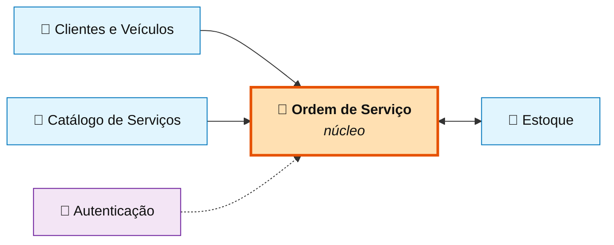
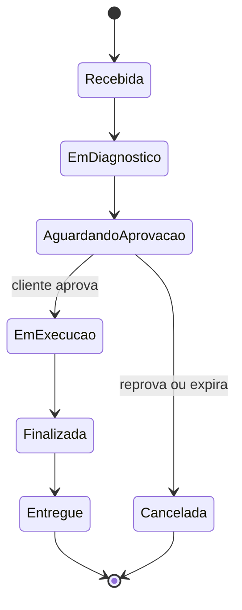

# Documentação — AutoMecanic

Documentação de *Domain-Driven Design* e arquitetura do **Sistema Integrado de Atendimento e
Execução de Serviços**, o back-end de gestão de uma oficina mecânica de médio porte.

---

## Por onde começar

Os documentos foram escritos para serem lidos nesta ordem, do vocabulário ao código:

| # | Documento | O que responde | Tempo |
|---|---|---|---|
| 1 | **[Linguagem Ubíqua](01-linguagem-ubiqua.md)** | *Que palavras a oficina usa, e o que exatamente cada uma significa?* | ~8 min |
| 2 | **[Event Storming](02-event-storming.md)** | *O que acontece no negócio, em que ordem, e o que dispara o quê?* | ~15 min |
| 3 | **[Context Map](03-context-map.md)** | *Onde um modelo termina e outro começa? Como conversam?* | ~10 min |
| 4 | **[Modelo de Domínio](04-modelo-de-dominio.md)** | *Quais são os agregados, e por que as fronteiras estão onde estão?* | ~15 min |
| 5 | **[Arquitetura](05-arquitetura.md)** | *Como o código está organizado, e o que cada decisão custou?* | ~12 min |
| 6 | **[Relatório de segurança](06-relatorio-de-seguranca.md)** | *O sistema é seguro? Como isso foi verificado?* | ~12 min |

> **Com pouco tempo?** Leia a [Linguagem Ubíqua](01-linguagem-ubiqua.md) e o
> [Fluxo 2 do Event Storming](02-event-storming.md#fluxo-2--elaboração-aprovação-e-reprovação-do-orçamento).
> Juntos, eles explicam a parte do negócio onde está toda a complexidade.

Para subir o sistema e experimentar os fluxos, veja o [README](../README.md).

---

## O desafio em uma frase

Uma oficina mecânica controlava atendimento, diagnóstico, execução e entrega em anotações
manuais e planilhas. Precisa de um sistema que **organize o fluxo de trabalho**, **controle
peças e insumos** e **permita ao cliente acompanhar o serviço** — sem perder o histórico e
sem que ninguém consiga aprovar um valor diferente do que foi apresentado.

---

## As cinco ideias que sustentam o modelo

Se você ler apenas uma parte desta documentação, leia esta.

### 1 · O status é consequência, nunca atribuição

Não existe "mudar o status para *Em execução*". Existe "o cliente aprovou o orçamento", e
disso decorre o status. Nenhum endpoint da API recebe um status como parâmetro.

> [Máquina de estados completa](04-modelo-de-dominio.md#máquina-de-estados)

### 2 · Preço entra na OS por cópia, não por referência

Quando um serviço é incluído em uma Ordem de Serviço, seu preço é **copiado e congelado**. Um
reajuste de tabela na semana seguinte não altera um orçamento já apresentado ao cliente.

> [Relacionamento Catálogo → Ordem de Serviço](03-context-map.md#catálogo-de-serviços--ordem-de-serviço--fornecedor--cliente-com-cópia)

### 3 · O estoque tem três saldos, não um

O que está na prateleira (*físico*), o que já foi prometido a orçamentos pendentes
(*reservado*) e o que ainda pode ser prometido (*disponível*). Sem essa separação, duas Ordens
de Serviço venderiam a mesma última peça ao cliente.

> [Agregado Peça](04-modelo-de-dominio.md#agregado-peça-)

### 4 · Enviar o orçamento congela os itens

A partir do envio, os itens da OS não podem ser alterados. Mudar o escopo exige devolver a OS
ao diagnóstico e gerar um orçamento novo — que o cliente verá antes de aprovar.

> [Fluxo do orçamento](02-event-storming.md#fluxo-2--elaboração-aprovação-e-reprovação-do-orçamento)

### 5 · Saldo e razão de estoque não podem divergir

O lançamento no razão é criado por um manipulador do evento de movimentação que roda **dentro
da mesma transação** que alterou o saldo. Se um falhar, o outro é desfeito.

> [Eventos despachados antes do commit](05-arquitetura.md#adr-04--eventos-de-domínio-despachados-antes-do-commit)

---

## Mapa dos contextos

> [Context Map detalhado](03-context-map.md)

---

## O ciclo de vida de uma Ordem de Serviço

> [Fluxos completos no Event Storming](02-event-storming.md)

---

## Onde cada requisito está documentado

| Requisito do desafio | Onde ler |
|---|---|
| Event Storming dos fluxos de OS e de estoque | [02 — Event Storming](02-event-storming.md) |
| Diagramas de contextos delimitados | [03 — Context Map](03-context-map.md) |
| Agregados, entidades, objetos de valor e eventos | [04 — Modelo de Domínio](04-modelo-de-dominio.md) |
| Linguagem Ubíqua aplicada | [01 — Linguagem Ubíqua](01-linguagem-ubiqua.md) |
| Justificativa da escolha do banco de dados | [05 — ADR-01](05-arquitetura.md#adr-01--postgresql-como-banco-de-dados) |
| Análise de vulnerabilidades | [06 — Relatório de segurança](06-relatorio-de-seguranca.md) |
| Instruções de uso e execução local | [README](../README.md) |
