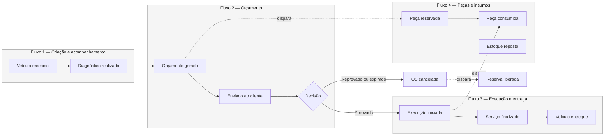
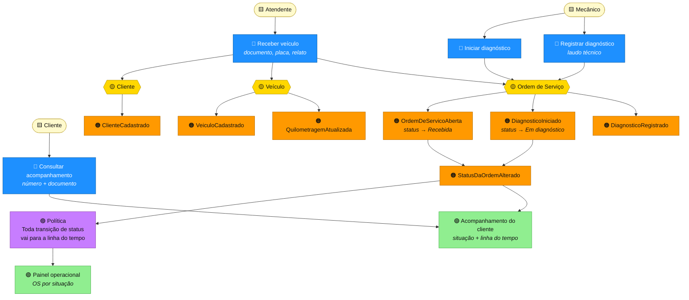
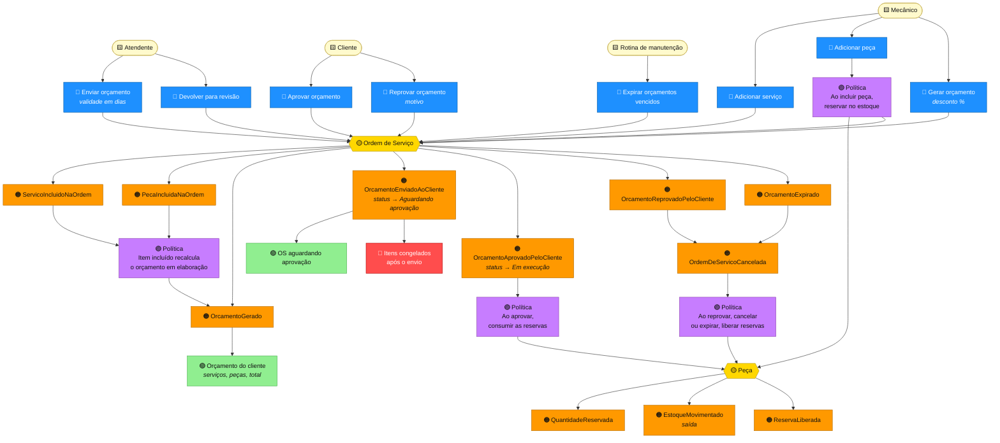
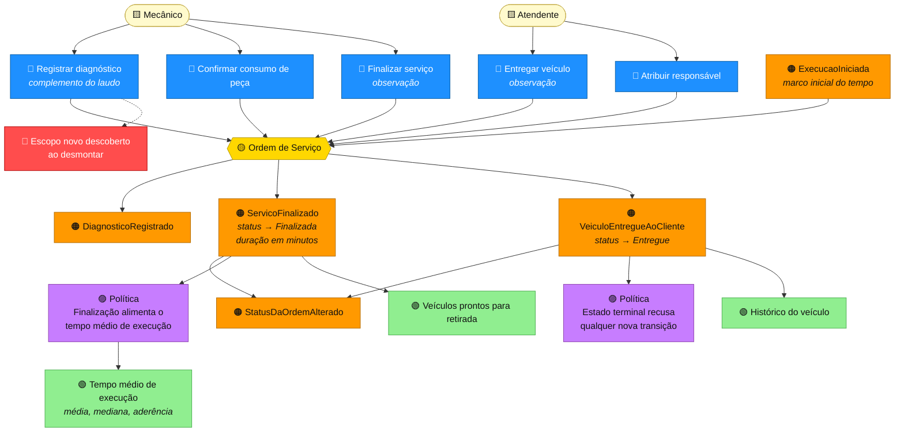
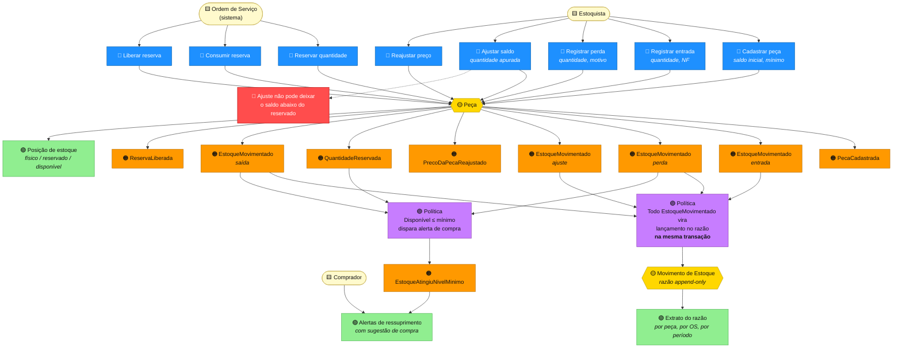

# Event Storming

> **O que é.** O resultado das sessões de Event Storming com a oficina: o negócio descrito
> como uma sequência de **fatos que acontecem**, e não como telas ou tabelas. Cada post-it do
> quadro virou um tipo no código — os eventos laranja são `record`s em `Events/`, os comandos
> azuis são métodos públicos dos agregados, e as políticas lilás são manipuladores de evento
> ou coordenação na camada de aplicação.

## Convenção de cores

| Cor | Post-it | O que representa | Onde vive no código |
|---|---|---|---|
| 🟠 Laranja | **Evento de Domínio** | Um fato que já aconteceu. Nome no passado. | `Domain/*/Events/*.cs` |
| 🔵 Azul | **Comando** | Uma intenção. Nome no imperativo. | Método público do agregado |
| 🟡 Amarelo | **Agregado** | Onde a decisão é tomada e a invariante é garantida. | Raiz de agregado |
| 🟣 Lilás | **Política** | "Sempre que X acontece, faça Y." | `IDomainEventHandler<T>` ou serviço de aplicação |
| 🟢 Verde | **Modelo de Leitura** | O que alguém precisa ver para decidir. | DTO de resposta / endpoint de consulta |
| 🟨 Bege | **Ator** | Quem dispara o comando. | Perfil de usuário / cliente final |
| 🔴 Vermelho | **Hotspot** | Dúvida, risco ou decisão em aberto. | Documentado ao fim de cada fluxo |

---

## Visão geral — a jornada completa

---

## Fluxo 1 — Criação e acompanhamento da Ordem de Serviço

### Narrativa

O cliente chega à oficina com o carro. O atendente pergunta o **CPF ou CNPJ** — se o cliente
já foi atendido antes, o cadastro aparece; se não, é criado na hora. O mesmo vale para o
veículo, buscado pela **placa**. O atendente registra a leitura do odômetro e o que o cliente
relatou ("está fazendo um barulho na frente"), e **a Ordem de Serviço nasce no status Recebida**.

O carro entra na fila. Quando um mecânico o assume, a OS passa a **Em diagnóstico**. O mecânico
avalia, registra o **laudo técnico** e monta a lista de serviços e peças.

Em paralelo, o cliente pode acompanhar tudo pelo número da OS mais o próprio documento.

### Quadro

### Tabela de rastreabilidade

| Comando (🔵) | Agregado (🟡) | Evento (🟠) | Regra que o agregado garante |
|---|---|---|---|
| Receber veículo | Cliente, Veículo, Ordem de Serviço | `ClienteCadastrado`, `VeiculoCadastrado`, `OrdemDeServicoAberta` | Documento e placa válidos; cliente e veículo ativos; **o veículo pertence ao cliente informado** |
| Iniciar diagnóstico | Ordem de Serviço | `DiagnosticoIniciado`, `StatusDaOrdemAlterado` | Só a partir de *Recebida* |
| Registrar diagnóstico | Ordem de Serviço | `DiagnosticoRegistrado` | Só em *Em diagnóstico* ou *Em execução*; laudo não vazio |
| Consultar acompanhamento | — (leitura) | — | **Número e documento juntos**; resposta idêntica quando não confere |

### Hotspots

> 🔴 **O veículo pode ter trocado de dono desde o último atendimento.**
> Decisão: a recepção detecta a divergência e **transfere o veículo** para o cliente que o
> trouxe, registrando `VeiculoTransferido`. A alternativa — recusar o atendimento — seria
> inaceitável para o balcão.

> 🔴 **O cliente digita o odômetro errado e informa um valor menor que o anterior.**
> Decisão: a quilometragem é **monotônica**. Um valor menor é recusado
> (`QUILOMETRAGEM_RETROATIVA`), porque na prática indica erro de digitação ou adulteração.

> 🔴 **Como o cliente consulta sem ter login?**
> Decisão: número da OS **mais** documento funcionam como prova de posse. Sem essa
> combinação, alguém poderia percorrer números sequenciais e ler dados de terceiros.

---

## Fluxo 2 — Elaboração, aprovação e reprovação do orçamento

### Narrativa

Com o laudo pronto, o mecânico inclui na OS os **serviços** do catálogo e as **peças**
necessárias. Cada inclusão de peça **reserva** a quantidade no estoque na mesma transação —
se não há saldo disponível, a inclusão inteira falha.

O sistema **calcula o orçamento** somando os itens e aplicando o desconto comercial. Nada é
digitado. O atendente envia ao cliente, e a OS passa a **Aguardando aprovação** — a partir
daqui os itens ficam **congelados**.

O cliente aprova ou reprova. Aprovando, a OS vai direto para **Em execução** e as peças
reservadas são **baixadas do estoque**. Reprovando, a OS é **cancelada** e as reservas voltam
ao disponível. Se o prazo vencer sem resposta, uma rotina de manutenção **expira** o orçamento
com o mesmo efeito da reprovação.

### Quadro

### Tabela de rastreabilidade

| Comando (🔵) | Agregados envolvidos (🟡) | Evento (🟠) | Regra garantida |
|---|---|---|---|
| Adicionar serviço | Ordem de Serviço, Serviço | `ServicoIncluidoNaOrdem` | Serviço ativo; **preço e tempo copiados e congelados**; itens ainda alteráveis |
| Adicionar peça | Ordem de Serviço, **Peça** | `PecaIncluidaNaOrdem` + `QuantidadeReservada` | **Reserva primeiro**: sem saldo disponível, a OS não muda |
| Gerar orçamento | Ordem de Serviço | `OrcamentoGerado` | Ao menos um item; **valor é sempre a soma dos itens**; desconto de 0 a 100 |
| Enviar orçamento | Ordem de Serviço | `OrcamentoEnviadoAoCliente` | Orçamento existente e não vazio; validade de 1 a 90 dias |
| Aprovar orçamento | Ordem de Serviço, **Peça** | `OrcamentoAprovadoPeloCliente`, `ExecucaoIniciada`, `EstoqueMovimentado` | Só a partir de *Aguardando aprovação*; **consumo e transição na mesma transação** |
| Reprovar orçamento | Ordem de Serviço, **Peça** | `OrcamentoReprovadoPeloCliente`, `OrdemDeServicoCancelada`, `ReservaLiberada` | Só a partir de *Aguardando aprovação* |
| Expirar orçamentos | Ordem de Serviço, **Peça** | `OrcamentoExpirado`, `OrdemDeServicoCancelada`, `ReservaLiberada` | Apenas os já vencidos |
| Devolver para revisão | Ordem de Serviço | `StatusDaOrdemAlterado` | Reabre o orçamento; **impossível se já aprovado** |

### Hotspots

> 🔴 **O cliente aprova um valor diferente do que viu.**
> Decisão: o envio do orçamento **congela os itens**. Qualquer alteração exige devolver a OS
> ao diagnóstico e gerar um orçamento novo, que o cliente verá de novo.

> 🔴 **Duas OS prometem a mesma última peça.**
> Decisão: o saldo é separado em *físico* e *reservado*. O que se pode prometer é o
> **disponível**. Um teste de integração cobre exatamente esse cenário.

> 🔴 **O cliente some e a peça fica presa indefinidamente.**
> Decisão: o orçamento tem **validade** (padrão 7 dias). Uma rotina de manutenção expira os
> vencidos e devolve as reservas. Exposta como
> `POST /ordens-servico/manutencao/expirar-orcamentos` para o agendador chamar.

> 🔴 **A oficina quer dar desconto acima do permitido.**
> Decisão em aberto para a Fase 2: hoje o desconto vai de 0 a 100% sem alçada. Uma regra de
> aprovação por faixa de desconto exigiria o conceito de *alçada*, que a oficina ainda não tem.

---

## Fluxo 3 — Execução e finalização do serviço

### Narrativa

Com o orçamento aprovado, a OS já está **Em execução** e o cronômetro do indicador de tempo
médio começou a contar. As peças reservadas foram baixadas do estoque e aplicadas no veículo.

Se, ao desmontar, o mecânico encontra algo novo, ele **complementa o laudo** — mas não pode
incluir itens: isso mudaria o valor que o cliente aprovou. O caminho correto é uma nova OS.

Concluídos os serviços, o mecânico **finaliza**: a OS passa a **Finalizada**, o tempo real de
execução passa a existir e o carro fica pronto para retirada. Quando o cliente busca o
veículo, o atendente registra a **entrega** — estado terminal.

### Quadro

### Tabela de rastreabilidade

| Comando (🔵) | Agregado (🟡) | Evento (🟠) | Regra garantida |
|---|---|---|---|
| Confirmar consumo de peça | Ordem de Serviço | — | Só com a OS *Em execução* |
| Registrar diagnóstico | Ordem de Serviço | `DiagnosticoRegistrado` | Permitido em execução; **não permite incluir itens** |
| Finalizar serviço | Ordem de Serviço | `ServicoFinalizado`, `StatusDaOrdemAlterado` | Só a partir de *Em execução*; calcula a duração real |
| Entregar veículo | Ordem de Serviço | `VeiculoEntregueAoCliente` | **Só a partir de *Finalizada*** — nunca pulando a finalização |
| Qualquer comando após a entrega | Ordem de Serviço | — | Recusado: estado terminal |

### Hotspots

> 🔴 **O mecânico descobre um problema novo ao desmontar.**
> Decisão: o laudo pode ser complementado, mas **os itens permanecem congelados**. Serviço
> adicional exige nova OS, com novo orçamento aprovado pelo cliente. É o que preserva a
> confiança do valor aprovado.

> 🔴 **A OS pode ser cancelada durante a execução?**
> Decisão: **não**. A partir da aprovação, peças saíram do estoque e horas foram trabalhadas.
> O cancelamento é permitido apenas em *Recebida*, *Em diagnóstico* e *Aguardando aprovação*.

> 🔴 **O tempo médio deve contar o tempo esperando o cliente decidir?**
> Decisão: **não**, e por isso existem dois indicadores. *Tempo de execução* mede a oficina
> (aprovação → finalização); *tempo total de atendimento* mede a experiência do cliente
> (abertura → entrega). Misturá-los faria a oficina parecer lenta por culpa da demora do cliente.

---

## Fluxo 4 — Gestão de peças e insumos

### Narrativa

O almoxarife cadastra a peça com **saldo inicial** e **ponto de ressuprimento**. A partir daí,
cada movimentação gera um lançamento no razão: **entrada** ao receber do fornecedor,
**saída** ao consumir em uma OS, **perda** por avaria, **ajuste** após contagem física e
**estorno** quando uma peça volta para a prateleira.

O saldo é sempre decomposto em três: o que está na prateleira, o que já foi prometido a
orçamentos pendentes, e o que resta para prometer. Quando o **disponível** cruza o ponto de
ressuprimento, o sistema alerta a compra.

### Quadro

### Tabela de rastreabilidade

| Comando (🔵) | Agregado (🟡) | Evento (🟠) | Regra garantida |
|---|---|---|---|
| Cadastrar peça | Peça | `PecaCadastrada`, `EstoqueMovimentado` (entrada) | Código único; preço > 0; saldo inicial registra lançamento |
| Registrar entrada | Peça | `EstoqueMovimentado` (entrada ou estorno) | Motivo obrigatório; classificado como estorno se vier de uma OS |
| Registrar perda | Peça | `EstoqueMovimentado` (perda) | **Não pode consumir o que já está reservado** |
| Ajustar saldo | Peça | `EstoqueMovimentado` (ajuste) | **Saldo apurado ≥ reservado**; registra a diferença |
| Reservar quantidade | Peça | `QuantidadeReservada` | Quantidade ≤ disponível; peça ativa |
| Consumir reserva | Peça | `EstoqueMovimentado` (saída) | Quantidade ≤ reservado; reduz físico e reserva juntos |
| Liberar reserva | Peça | `ReservaLiberada` | Quantidade ≤ reservado |
| Inativar peça | Peça | `PecaInativada` | **Impossível com reserva pendente** |

### Hotspots

> 🔴 **A contagem física acusa menos peças do que o sistema, mas há reservas.**
> Decisão: o ajuste é **recusado** se o saldo apurado for menor que o reservado
> (`AJUSTE_INVALIDO`). Aceitá-lo deixaria promessas já feitas ao cliente sem lastro físico.
> O caminho é liberar as reservas afetadas primeiro — decisão humana, com contato ao cliente.

> 🔴 **O saldo pode divergir do razão?**
> Decisão: **não pode**, e a garantia é estrutural. O lançamento é criado por um manipulador
> do evento `EstoqueMovimentado` que roda **dentro da mesma transação** que alterou o saldo.
> Se um falhar, o outro é desfeito.

> 🔴 **Quanto comprar quando o alerta dispara?**
> Decisão para o MVP: sugerir a reposição até o **dobro do ponto de ressuprimento**, criando
> uma folga de um ciclo. Um cálculo baseado em consumo histórico e prazo de entrega do
> fornecedor fica para a Fase 2.

---

## Consolidação — todos os eventos de domínio

| Evento | Contexto | Disparado por | Consumido por |
|---|---|---|---|
| `ClienteCadastrado` | Clientes | Cadastro / recepção | Auditoria |
| `DadosDeContatoDoClienteAtualizados` | Clientes | Atualização cadastral | Auditoria |
| `ClienteInativado` / `ClienteReativado` | Clientes | Gestão administrativa | Auditoria |
| `VeiculoCadastrado` | Veículos | Cadastro / recepção | Auditoria |
| `QuilometragemAtualizada` | Veículos | Recepção do veículo | Histórico de manutenção |
| `VeiculoTransferido` | Veículos | Troca de proprietário | Auditoria |
| `VeiculoInativado` | Veículos | Gestão administrativa | Auditoria |
| `ServicoCadastrado` | Catálogo | Gestão do catálogo | Auditoria |
| `PrecoDoServicoReajustado` | Catálogo | Reajuste de tabela | Auditoria de formação de preço |
| `ServicoInativado` | Catálogo | Gestão do catálogo | Auditoria |
| `PecaCadastrada` | Estoque | Cadastro no almoxarifado | Auditoria |
| `EstoqueMovimentado` | Estoque | Toda alteração de saldo | **Razão de estoque** (mesma transação) |
| `EstoqueAtingiuNivelMinimo` | Estoque | Saldo cruza o ponto de ressuprimento | Alerta de compra |
| `QuantidadeReservada` / `ReservaLiberada` | Estoque | Inclusão/remoção de peça na OS | Posição de estoque |
| `PrecoDaPecaReajustado` | Estoque | Reajuste de preço | Auditoria |
| `PecaInativada` | Estoque | Gestão do almoxarifado | Auditoria |
| `OrdemDeServicoAberta` | Ordem de Serviço | Recepção | Painel operacional |
| `DiagnosticoIniciado` / `DiagnosticoRegistrado` | Ordem de Serviço | Mecânico | Acompanhamento |
| `ServicoIncluidoNaOrdem` / `PecaIncluidaNaOrdem` | Ordem de Serviço | Composição do orçamento | Recálculo do orçamento |
| `ItemRemovidoDaOrdem` | Ordem de Serviço | Remoção de item | Liberação de reserva |
| `OrcamentoGerado` | Ordem de Serviço | Cálculo automático | Orçamento do cliente |
| `OrcamentoEnviadoAoCliente` | Ordem de Serviço | Envio ao cliente | Notificação; congelamento de itens |
| `OrcamentoAprovadoPeloCliente` | Ordem de Serviço | Decisão do cliente | **Consumo das reservas** |
| `OrcamentoReprovadoPeloCliente` | Ordem de Serviço | Decisão do cliente | **Liberação das reservas** |
| `OrcamentoExpirado` | Ordem de Serviço | Rotina de manutenção | **Liberação das reservas** |
| `ExecucaoIniciada` | Ordem de Serviço | Aprovação do orçamento | Marco inicial do tempo de execução |
| `ServicoFinalizado` | Ordem de Serviço | Mecânico | **Tempo médio de execução** |
| `VeiculoEntregueAoCliente` | Ordem de Serviço | Atendente | Histórico do veículo |
| `OrdemDeServicoCancelada` | Ordem de Serviço | Reprovação, expiração ou desistência | Liberação de reservas |
| `StatusDaOrdemAlterado` | Ordem de Serviço | Toda transição | Linha do tempo; acompanhamento |
| `UsuarioCriado` / `UsuarioInativado` | Autenticação | Gestão de acesso | Auditoria |
| `UsuarioAutenticado` | Autenticação | Login bem-sucedido | Trilha de acesso |
| `UsuarioBloqueado` | Autenticação | 5 tentativas malsucedidas | Alerta de segurança |
| `SenhaAlterada` | Autenticação | Troca ou redefinição | Auditoria |

---

**Próximo:** [Context Map](03-context-map.md) — como os contextos se relacionam.
