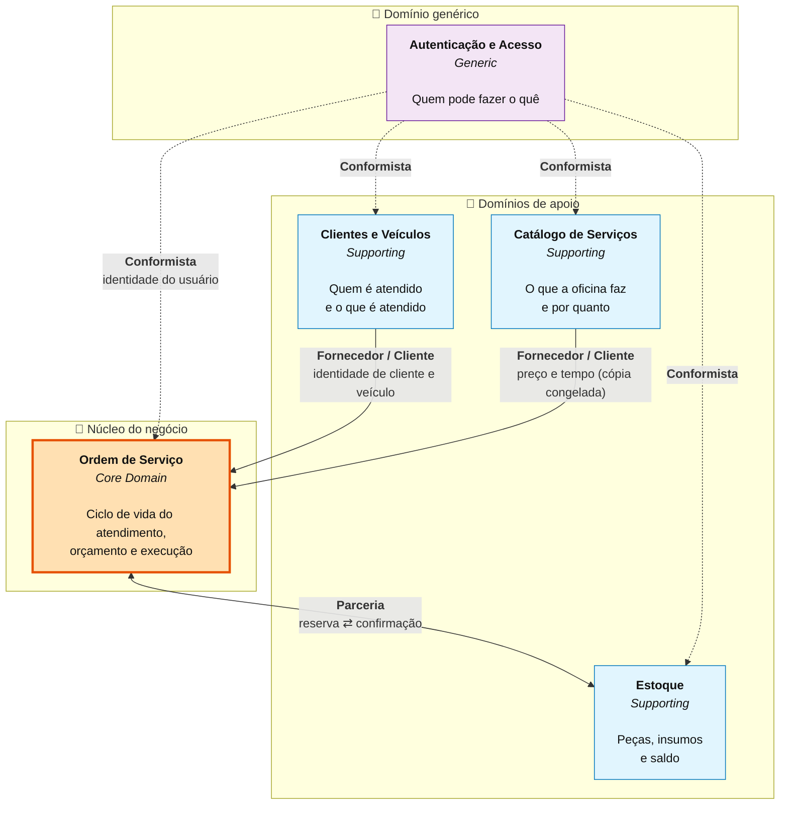
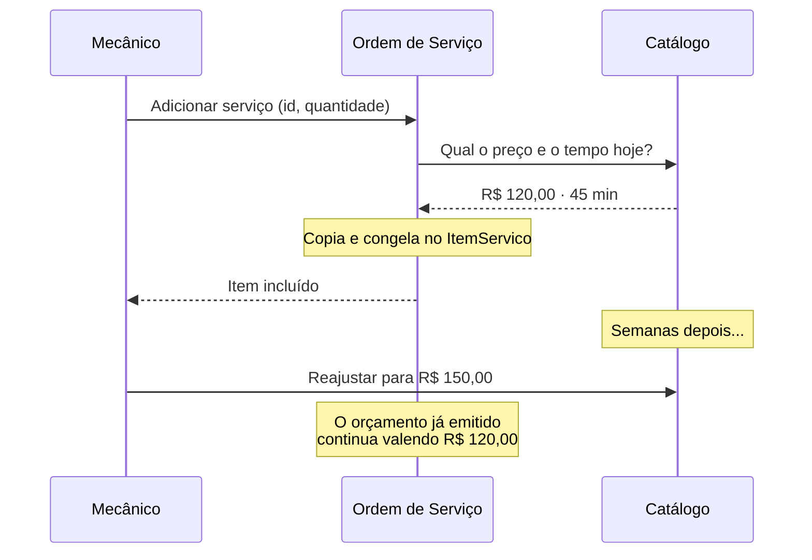
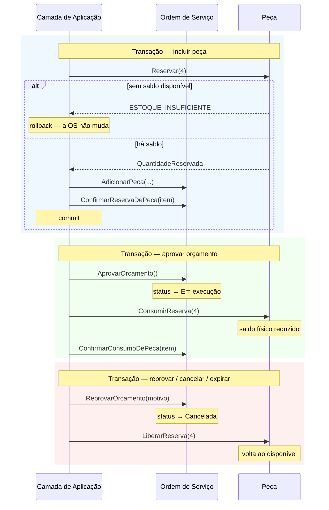

# Context Map — Contextos Delimitados

> **O que é.** As fronteiras dentro das quais cada termo tem um significado só, e a natureza
> da relação entre elas. Um Context Map não descreve módulos de código: descreve **onde um
> modelo deixa de valer** e outro começa.

## Os cinco contextos



---

## Por que estes contextos, e não outros

A tentação natural seria separar por entidade — um contexto por tabela. A separação abaixo
segue outro critério: **onde as regras mudam de dono e de vocabulário**.

### 🎯 Ordem de Serviço — *Core Domain*

É onde está o diferencial da oficina e onde mora a complexidade que justifica DDD: a máquina
de estados, o congelamento do orçamento, a coordenação com o estoque, o indicador de tempo.
É o contexto que **recebe mais investimento de modelagem e de teste** — os outros existem
para servi-lo.

**Vocabulário próprio:** Ordem de Serviço, Orçamento, Item de Serviço, Item de Peça,
Diagnóstico, Status, Linha do Tempo.

### 🔧 Clientes e Veículos — *Supporting*

Cadastro com regras próprias de identificação (CPF/CNPJ, placa) e de ciclo de vida
(inativação em vez de exclusão, transferência de titularidade). Não é o diferencial da
oficina, mas tem regras demais para ser tratado como CRUD anêmico.

**Vocabulário próprio:** Cliente, Veículo, Documento, Placa, Quilometragem.

> **Um contexto, dois agregados.** Cliente e Veículo compartilham a mesma linguagem e mudam
> pelos mesmos motivos, mas são **agregados separados**: o veículo tem ciclo de vida próprio
> (pode ser transferido), é consultado sem carregar o cliente, e é a ele que a OS se refere.

### 🔧 Estoque — *Supporting*

A distinção entre saldo físico, reservado e disponível é regra de negócio de verdade — é o
que impede duas OS de venderem a mesma peça. O razão *append-only* é exigência de auditoria.

**Vocabulário próprio:** Peça, Insumo, Reserva, Movimento, Saldo Disponível, Ponto de
Ressuprimento.

### 🔧 Catálogo de Serviços — *Supporting*

Mantém o preço de tabela e o tempo estimado. Deliberadamente simples: sua única regra
sofisticada é que o preço muda para o **futuro**, nunca para orçamentos já emitidos.

**Vocabulário próprio:** Serviço, Categoria, Preço de Tabela, Tempo Estimado.

### 🔐 Autenticação e Acesso — *Generic Subdomain*

Não tem nada de específico de oficina mecânica. Está aqui porque o requisito exige JWT nas
APIs administrativas. Em um sistema maior, seria substituído por um provedor de identidade
externo sem impacto nos demais contextos.

**Vocabulário próprio:** Usuário, Perfil, Token, Política de Acesso.

---

## Os relacionamentos, um a um

### Clientes e Veículos → Ordem de Serviço · **Fornecedor / Cliente**

O contexto de Clientes é o **fornecedor** (*upstream*): define o modelo de cliente e veículo.
A Ordem de Serviço é a **cliente** (*downstream*): consome esse modelo e se adapta a ele.

**Como acontece na prática:** a OS guarda apenas `ClienteId` e `VeiculoId`. Não há propriedade
de navegação de `OrdemServico` para `Cliente` no domínio — a ausência é intencional, para que
nenhum código atravesse a fronteira do agregado sem perceber.

```csharp
// Domain/OrdensServico/OrdemServico.cs
public Guid ClienteId { get; private set; }   // referência por identidade
public Guid VeiculoId { get; private set; }   // nunca por navegação
```

A validação que cruza a fronteira ("o cliente está ativo?", "o veículo é dele?") vive na
**camada de aplicação**, que é o único lugar autorizado a enxergar os dois contextos:

```csharp
// Application/OrdensServico/ServicoDeOrdensServico.cs
cliente.GarantirClienteAtivo();
veiculo.GarantirVeiculoAtivo();

if (veiculo.ClienteId != cliente.Id)
{
    throw new ConflitoException("VEICULO_DE_OUTRO_CLIENTE", ...);
}
```

---

### Catálogo de Serviços → Ordem de Serviço · **Fornecedor / Cliente com cópia**

Mesma direção do anterior, mas com uma característica que merece destaque: a OS **não
referencia o preço, ela o copia**.



**Por que a cópia:** um reajuste de tabela não pode alterar retroativamente um orçamento que
o cliente já aprovou. A cópia torna essa garantia estrutural — não depende de ninguém lembrar.

---

### Ordem de Serviço ⇄ Estoque · **Parceria**

Este é o único relacionamento **bidirecional**, e o mais delicado do sistema. Nenhum dos dois
contextos manda no outro:

- A **Ordem de Serviço** decide *se pode* incluir uma peça (o orçamento já foi enviado?);
- O **Estoque** decide *se há* peça para isso (o disponível cobre a quantidade?).

As duas decisões precisam valer juntas, e é isso que faz da coordenação uma **transação
explícita** na camada de aplicação:



**A ordem das operações importa.** Ao incluir uma peça, a reserva vem **primeiro**: assim a
falta de saldo aborta tudo antes de qualquer alteração na OS, e os dois agregados permanecem
coerentes.

---

### Autenticação → todos os demais · **Conformista**

A Autenticação é *upstream* de todos, e todos são **conformistas**: consomem o modelo de
identidade como ele é, sem tradução.

Na prática, o acoplamento é mínimo e unidirecional: os contextos recebem um `Guid` de usuário
através da abstração `IUsuarioAtual` e o usam apenas para registrar autoria. Nenhum contexto
conhece `Usuario`, perfil ou token.

```csharp
// Application/Abstractions/Servicos.cs — a única superfície de contato
public interface IUsuarioAtual
{
    Guid? Id { get; }
    PerfilUsuario? Perfil { get; }
    bool EstaAutenticado { get; }
}
```

É essa estreiteza que permitiria trocar a Autenticação por um provedor externo (Keycloak,
Entra ID) alterando apenas a implementação dessa interface.

---

## Núcleo Compartilhado (*Shared Kernel*)

Um único conceito é compartilhado por todos os contextos: **`Dinheiro`**.

```csharp
// Domain/SharedKernel/Dinheiro.cs
public sealed class Dinheiro : ValueObject
{
    public static Dinheiro De(decimal valor);       // proíbe negativo, arredonda a 2 casas
    public Dinheiro Somar(Dinheiro outro);
    public Dinheiro AplicarDescontoPercentual(decimal percentual);
}
```

Compartilhá-lo é deliberado: "R$ 120,00" significa exatamente a mesma coisa no catálogo, no
estoque e no orçamento, e duplicar a lógica de arredondamento em três lugares seria a receita
para os três divergirem em centavos.

O núcleo compartilhado é mantido **deliberadamente pequeno** — todo conceito colocado aqui
precisa ser alterado com o acordo de todos os contextos.

---

## Camada Anticorrupção — onde ainda não existe

Nenhuma **Camada Anticorrupção** foi construída neste MVP, e a razão é simples: todos os
contextos são internos, evoluem juntos e compartilham a mesma linguagem ubíqua. Uma ACL aqui
seria cerimônia sem benefício.

Ela passa a ser necessária no momento em que entrar um sistema externo com modelo próprio:

| Integração futura | Por que exigiria ACL |
|---|---|
| Emissão de NF-e | O modelo fiscal (CFOP, NCM, CST) nada tem a ver com o modelo da oficina |
| Catálogo de peças do fornecedor | Código do fabricante ≠ SKU interno; unidades de medida divergentes |
| Gateway de pagamento | Modelo de transação, estorno e conciliação próprio |
| Consulta de tabela FIPE | Modelo de veículo do terceiro, com versionamento próprio |

---

## Do mapa ao código

A estrutura de pastas espelha os contextos, tanto no domínio quanto na aplicação:

```
src/AutoMecanic.Domain/
├── SharedKernel/            🔗 Núcleo compartilhado — Dinheiro
├── Abstractions/               blocos de construção (Entity, ValueObject, ...)
├── Clientes/                🔧 Contexto Clientes e Veículos
├── Veiculos/                🔧 Contexto Clientes e Veículos
├── Servicos/                🔧 Contexto Catálogo de Serviços
├── Estoque/                 🔧 Contexto Estoque
├── OrdensServico/           🎯 Contexto Ordem de Serviço (núcleo)
└── Identidade/              🔐 Contexto Autenticação e Acesso
```

E as fronteiras são visíveis no próprio esquema do banco: as chaves estrangeiras entre
contextos são todas `ON DELETE RESTRICT`, nunca `CASCADE` — apagar um cliente jamais deve
apagar Ordens de Serviço em outro contexto.

---

**Próximo:** [Modelo de Domínio](04-modelo-de-dominio.md) — agregados, entidades e invariantes.
