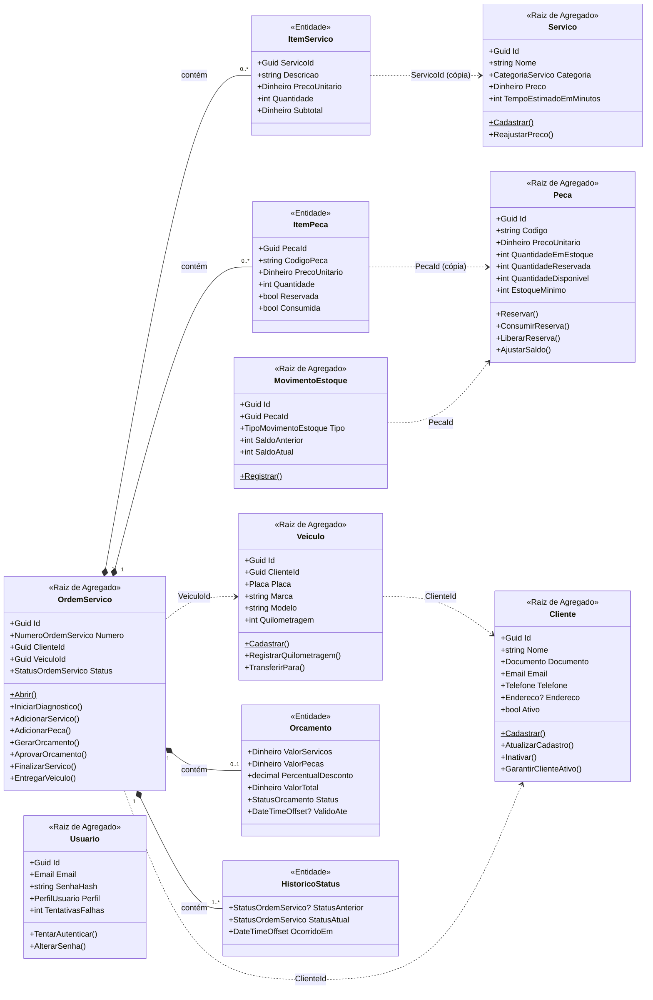
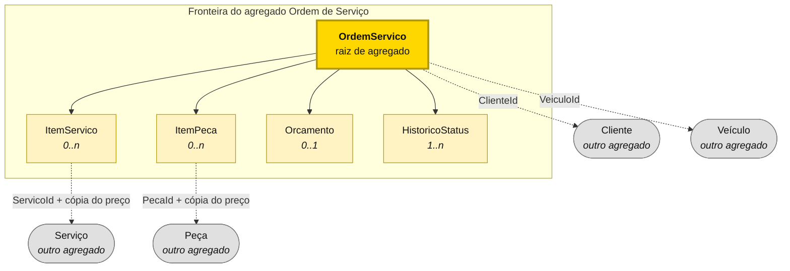
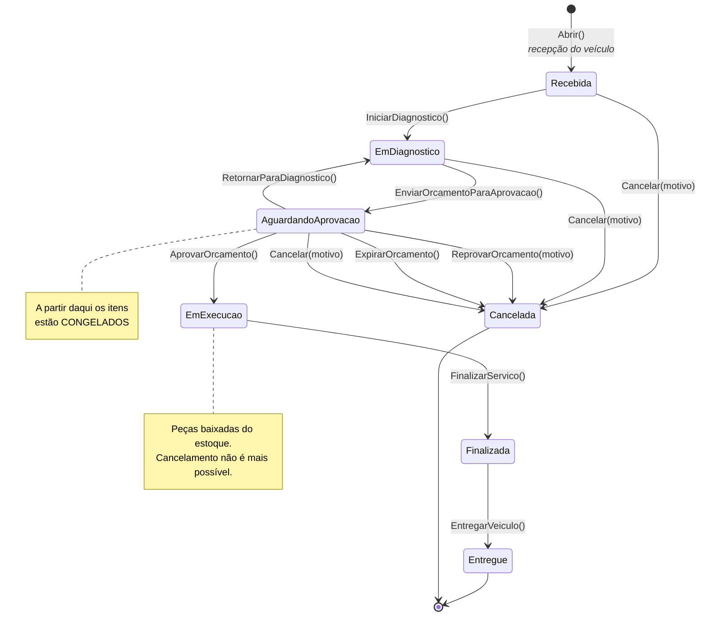
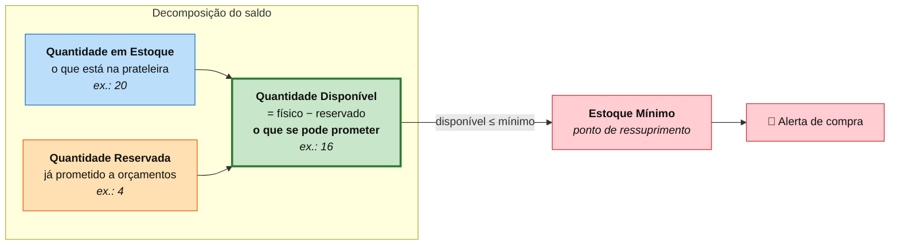
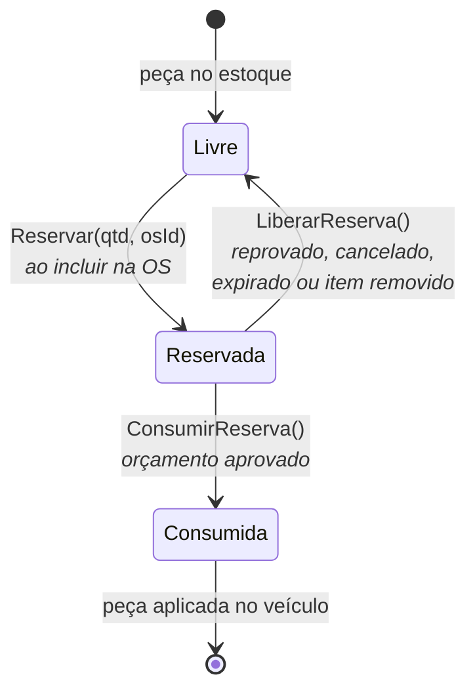
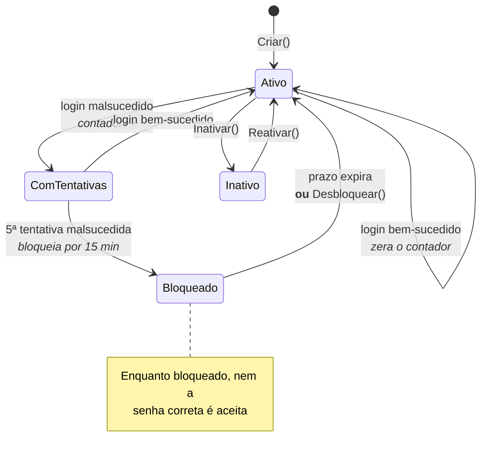
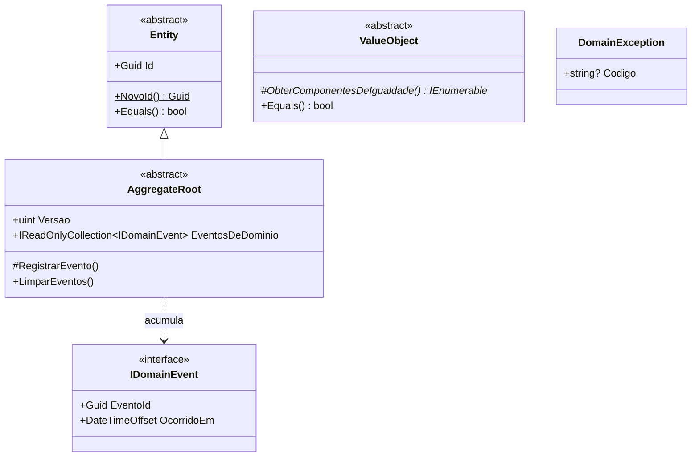
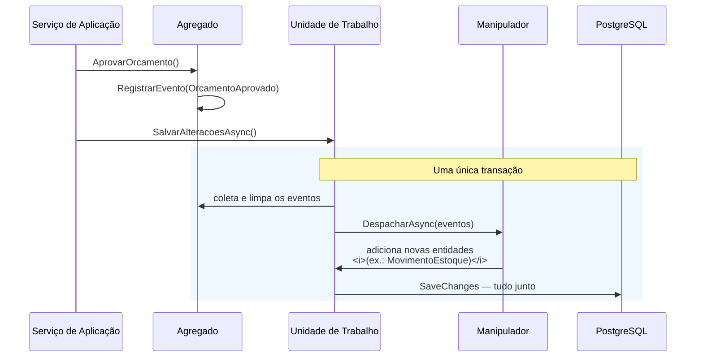

# Modelo de Domínio

> **O que é.** Os agregados, entidades, objetos de valor e regras que compõem o modelo, e —
> mais importante — **por que cada fronteira está onde está**. Um agregado não é um grupo de
> tabelas: é uma fronteira de consistência, e a pergunta que a define é *"o que precisa mudar
> junto, na mesma transação?"*.

## Visão geral



> **Leitura das setas:** losango preenchido (`*--`) = **composição**, a entidade filha não
> existe fora do agregado. Linha tracejada (`..>`) = **referência por identidade**, atravessa
> fronteira de agregado e carrega apenas o `Guid`.

---

## Agregado: Ordem de Serviço 🎯

O agregado central. A fronteira responde à pergunta: *o que precisa ser verdadeiro no mesmo
instante?*



### Por que estas quatro entidades estão dentro

| Entidade filha | Por que faz parte do agregado |
|---|---|
| `ItemServico` | O valor do orçamento é a soma dos itens. Alterar um item **tem que** recalcular o total no mesmo instante, ou o cliente vê um valor que não corresponde ao que vai pagar. |
| `ItemPeca` | Mesma razão, mais a situação de reserva/consumo, que precisa acompanhar as transições da OS. |
| `Orcamento` | Sua situação (*enviado*, *aprovado*) é o que determina se os itens podem ser alterados. Fora do agregado, essa regra viraria uma consulta que alguém esqueceria de fazer. |
| `HistoricoStatus` | Toda transição precisa deixar rastro. Registrar dentro do agregado torna impossível mudar o status sem gravar a linha do tempo. |

### O que ficou de fora, e por quê

| Conceito | Por que é agregado separado |
|---|---|
| `Cliente`, `Veículo` | Ciclo de vida independente. O veículo é transferido, consultado e alterado sem que exista uma OS. |
| `Serviço`, `Peça` | São catálogos globais. Carregá-los junto obrigaria a bloquear o catálogo inteiro para alterar uma OS. |
| `MovimentoEstoque` | A coleção cresce indefinidamente. Mantê-la dentro obrigaria a carregar todo o histórico para movimentar uma única peça. |

### Máquina de estados



**A propriedade que a máquina garante:** não existe caminho para `Entregue` que não passe por
`Finalizada`, nem para `EmExecucao` que não passe por uma aprovação de orçamento. Não é
convenção — é o que o código recusa fazer:

```csharp
// Domain/OrdensServico/OrdemServico.cs
private void ExigirStatus(StatusOrdemServico destino, StatusOrdemServico[] origensPermitidas)
{
    GarantirNaoTerminal();

    if (!origensPermitidas.Contains(Status))
    {
        throw new DomainException("TRANSICAO_INVALIDA",
            $"Não é possível mover a Ordem de Serviço para '{destino.Descricao()}' " +
            $"a partir de '{Status.Descricao()}'.");
    }
}
```

### Invariantes

| # | Invariante | Onde é garantida |
|---|---|---|
| 1 | Toda OS tem cliente, veículo e relato do problema | `Abrir()` |
| 2 | O status só muda por transição válida | `ExigirStatus()` |
| 3 | Itens só mudam antes do envio do orçamento | `GarantirItensAlteraveis()` |
| 4 | O orçamento é sempre a **soma calculada** dos itens | `GerarOrcamento()` · `RecalcularOrcamentoSeExistir()` |
| 5 | A execução só começa com orçamento aprovado | `AprovarOrcamento()` |
| 6 | A entrega só ocorre após a finalização | `EntregarVeiculo()` |
| 7 | Estados terminais não admitem transições | `GarantirNaoTerminal()` |
| 8 | Peça consumida não pode ser removida nem ter quantidade alterada | `ItemPeca.AlterarQuantidade()` |
| 9 | Toda transição gera registro na linha do tempo | `AlterarStatus()` |
| 10 | O cancelamento só é permitido antes da execução | `Status.PermiteCancelamento()` |

---

## Agregado: Peça 📦

A fronteira de consistência do **saldo**.



### O ciclo de vida de uma reserva



### Invariantes

| # | Invariante | Consequência de violá-la |
|---|---|---|
| 1 | `QuantidadeEmEstoque ≥ 0` | Saldo negativo: estoque fictício |
| 2 | `QuantidadeReservada ≥ 0` | Reserva negativa: promessa inexistente |
| 3 | `QuantidadeReservada ≤ QuantidadeEmEstoque` | Prometer mais do que existe |
| 4 | Reserva ≤ disponível | Duas OS vendem a mesma peça |
| 5 | Consumo ≤ reservado | Baixar peça que ninguém separou |
| 6 | Ajuste não pode ficar abaixo do reservado | Promessas sem lastro físico |
| 7 | Perda não consome o reservado | Peça prometida some sem aviso |
| 8 | Peça com reserva pendente não é inativada | Orçamento apontando para item fora de linha |
| 9 | Código único; preço > 0 | Ambiguidade de SKU; item de graça no orçamento |

> As invariantes 1, 2, 3 e o preço positivo são declaradas **também no banco**, como
> restrições `CHECK`. Se um dia alguém alterar dados por SQL direto, a garantia continua valendo:
>
> ```sql
> ALTER TABLE automecanic.peca
>   ADD CONSTRAINT ck_peca_reserva_menor_que_saldo
>   CHECK (quantidade_reservada <= quantidade_em_estoque);
> ```

---

## Agregado: Movimento de Estoque 📒

Um agregado à parte, **imutável**, formando o razão (kardex) do almoxarifado.

**Por que não é filho de `Peca`:** a coleção cresce indefinidamente. Mantê-la dentro do
agregado obrigaria a carregar milhares de lançamentos para movimentar uma unidade.

**Como saldo e razão não divergem:** o lançamento não é criado por quem movimenta o estoque —
é criado por um manipulador do evento `EstoqueMovimentado` que roda **dentro da mesma
transação**:

```csharp
// Application/Estoque/Handlers/RegistrarMovimentoNoRazaoHandler.cs
public async Task TratarAsync(EstoqueMovimentado evento, CancellationToken ct)
{
    var movimento = MovimentoEstoque.Registrar(
        evento.PecaId, evento.Tipo, evento.Quantidade,
        evento.SaldoAnterior, evento.SaldoAtual,
        evento.Motivo, evento.OrdemServicoId, evento.OcorridoEm);

    await repositorio.AdicionarAsync(movimento, ct);
}
```

Se a gravação do razão falhar, a alteração de saldo é desfeita junto. **Não existe saldo sem
lançamento correspondente.**

---

## Agregados: Cliente e Veículo 👤🚗

Dois agregados no mesmo contexto, referenciando-se por identidade.

**Por que o veículo não é entidade filha do cliente:**

1. Tem ciclo de vida próprio — pode ser **transferido** e continuar o mesmo veículo;
2. É consultado e alterado sem carregar o cliente (recepção busca por placa);
3. É a ele que a Ordem de Serviço se refere;
4. Um cliente com muitos veículos forçaria carregar todos para alterar um.

### Invariantes

| Agregado | Invariante |
|---|---|
| Cliente | Documento válido (dígito verificador) e único; nome de 3 a 150 caracteres; **documento imutável** |
| Cliente | Cliente inativo não recebe novas OS nem atualização cadastral |
| Veículo | Placa válida nos dois padrões e única; **placa imutável** |
| Veículo | Ano de fabricação plausível; ano-modelo = fabricação ou fabricação + 1 |
| Veículo | **Quilometragem monotônica** — nunca retrocede |
| Veículo | Veículo inativo não recebe novas OS |

---

## Agregado: Usuário 🔐

Concentra as regras de segurança que o requisito exige.



**A senha em claro nunca entra no domínio.** O agregado recebe uma *função* de hash injetada
pela infraestrutura, o que mantém o domínio livre de dependência de biblioteca criptográfica:

```csharp
public static Usuario Criar(string? nome, string? email, string? senha,
                            PerfilUsuario perfil, Func<string, string> gerarHash)
{
    return new Usuario(NovoId(), ValidarNome(nome), Email.Criar(email),
                       gerarHash(ValidarPolitcaDeSenha(senha)), perfil);
}
```

---

## Objetos de Valor

Cada objeto de valor existe para **tornar um estado inválido impossível de representar**.

### `Documento` — CPF ou CNPJ

Valida os dígitos verificadores, não só o formato. Rejeita explicitamente sequências repetidas
(`111.111.111-11`), que passam no módulo 11 mas não são documentos válidos.

Aceita o **CNPJ alfanumérico** adotado pela Receita Federal: 12 posições alfanuméricas
seguidas de 2 dígitos verificadores. O algoritmo usa `ASCII − 48` para o valor de cada
posição, o que faz letras valerem 17 a 42 e mantém o cálculo **idêntico** para CNPJ numérico.

```csharp
private static char CalcularDigitoModulo11(string baseCalculo, int[] pesos)
{
    var soma = 0;
    for (var i = 0; i < baseCalculo.Length; i++)
        soma += (baseCalculo[i] - '0') * pesos[i];   // '0'→0 … 'A'→17 … 'Z'→42

    var resto = soma % 11;
    return (char)('0' + (resto < 2 ? 0 : 11 - resto));
}
```

### `Placa` — brasileira e Mercosul

Aceita `ABC1234` e `ABC1D23`, normalizando entrada (`abc-1234` → `ABC1234`) para que a mesma
placa digitada de formas diferentes seja reconhecida como o mesmo veículo.

### `Dinheiro` — valor em reais

Arredonda a 2 casas com `MidpointRounding.ToEven` (arredondamento bancário), evitando o viés
sistemático que apareceria ao somar muitos itens de orçamento. Proíbe valores negativos.

### `Email`, `Telefone`, `Endereco`

- **Email** — formato validado e normalizado para minúsculas; limite de 254 caracteres (RFC 5321).
- **Telefone** — 10 ou 11 dígitos com DDD validado contra a faixa oficial; celular exige o nono dígito.
- **Endereco** — opcional, mas **completo quando informado**; UF validada, CEP com 8 dígitos.

### `NumeroOrdemServico` — o número que o cliente vê

Formato `OS-AAAA-NNNNNN`, reiniciado a cada ano. A alocação é atômica no banco:

```sql
INSERT INTO automecanic.sequencia_ordem_servico (ano, ultimo_valor)
VALUES (@ano, 1)
ON CONFLICT (ano) DO UPDATE SET ultimo_valor = sequencia_ordem_servico.ultimo_valor + 1
RETURNING ultimo_valor;
```

Duas requisições simultâneas são serializadas pelo bloqueio de linha do PostgreSQL e recebem
números diferentes. Ler-e-incrementar em duas etapas produziria duplicatas sob concorrência.

---

## Blocos de construção



| Bloco | Papel | Detalhe de implementação |
|---|---|---|
| `Entity` | Identidade estável | `Guid.CreateVersion7()` — ordenável por tempo, reduz fragmentação de índice no PostgreSQL |
| `AggregateRoot` | Fronteira de consistência | `Versao` mapeada para `xmin` do PostgreSQL: concorrência otimista |
| `ValueObject` | Igualdade estrutural | Compara os componentes declarados por cada tipo |
| `DomainEvent` | Fato consumado | `record` imutável, nome no passado |
| `DomainException` | Violação de invariante | Traduzida para **HTTP 422**, distinta de erro de formato (400) e falha técnica (500) |

### O ciclo de vida de um evento de domínio



**Despachar antes do `SaveChanges` é decisão de projeto:** as entidades que os manipuladores
criarem entram na mesma gravação e, portanto, na mesma transação.

---

## Do modelo ao banco

O mapeamento preserva o modelo em vez de achatá-lo:

| Conceito do modelo | Estratégia de persistência | Por quê |
|---|---|---|
| Objeto de valor de campo único | `ValueConverter` para coluna de texto | Esquema simples; indexável; reconstruído pela fábrica do domínio, então **nenhum valor inválido entra na memória, nem vindo do banco** |
| `Endereco` (multi-campo) | Tipo *owned*, colunas no próprio registro | Não tem sentido fora do cliente |
| Entidades filhas da OS | *Owned collections* em tabelas próprias, sempre carregadas | O agregado nunca é carregado pela metade |
| Enumerações | Gravadas **por nome** | `SELECT status FROM ordem_servico` é autoexplicativo |
| `Dinheiro` | `numeric(14,2)` | Decimal exato, sem erro de ponto flutuante |
| Propriedades derivadas | `Ignore` — calculadas em memória | Não podem divergir da fonte da verdade |
| `Versao` | `xmin` (`xid`) do PostgreSQL | Concorrência otimista sem coluna extra |
| Nomes | `snake_case` por convenção automática | Idiomático em PostgreSQL; dispensa aspas em SQL manual |

---

**Próximo:** [Arquitetura e decisões técnicas](05-arquitetura.md).
