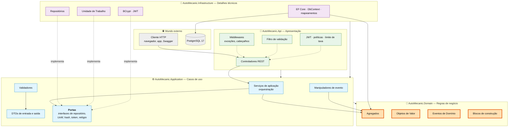
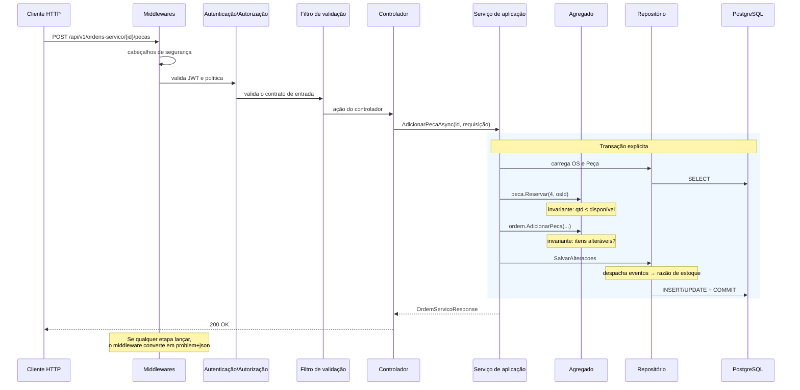

# Arquitetura e decisões técnicas

> **O que é.** Como o código está organizado, por que cada decisão foi tomada e o que ela
> custa. Toda escolha aqui tem uma alternativa razoável que foi descartada — e o motivo do
> descarte está registrado.

## Arquitetura em camadas

O requisito pede um **monolito em arquitetura de camadas**. A regra de dependência é única e
inegociável: **as setas apontam para dentro**.



### A regra de dependência, verificada

| Projeto | Referencia | Pacotes NuGet |
|---|---|---|
| `AutoMecanic.Domain` | **nada** | **nenhum** |
| `AutoMecanic.Application` | Domain | FluentValidation, abstrações de DI e log |
| `AutoMecanic.Infrastructure` | Application | EF Core, Npgsql, BCrypt, JWT |
| `AutoMecanic.Api` | Infrastructure | ASP.NET Core, Swashbuckle, Serilog |

O `.csproj` do domínio carrega um comentário explicando o vazio:

```xml
<!--
  A camada de Domínio é deliberadamente livre de dependências de infraestrutura.
  Nenhum PackageReference é adicionado aqui: o modelo de domínio é POCO puro.
-->
```

**Por que isso importa na prática:** as 439 verificações unitárias do domínio rodam em ~3
segundos, sem banco, sem contêiner e sem configuração. Uma regra de negócio testável em
milissegundos é uma regra que a equipe realmente testa.

### A inversão que sustenta o desenho

A Infraestrutura depende da Aplicação, e não o contrário. As **portas** (interfaces) são
declaradas onde são consumidas; as implementações ficam do lado de fora:

```csharp
// Application/Abstractions/Repositorios.cs — a porta, declarada onde é usada
public interface IRepositorioDePecas : IRepositorio<Peca>
{
    Task<Peca?> ObterPorCodigoAsync(string codigo, CancellationToken ct = default);
    Task<IReadOnlyList<Peca>> ListarAbaixoDoEstoqueMinimoAsync(CancellationToken ct = default);
}

// Infrastructure/.../RepositorioDePecas.cs — o adaptador, do lado de fora
public sealed class RepositorioDePecas(AutoMecanicDbContext contexto)
    : RepositorioBase<Peca>(contexto), IRepositorioDePecas { … }
```

Trocar PostgreSQL por outro banco significa reescrever um projeto. Domínio e Aplicação não
mudam uma linha.

---

## Decisões de arquitetura

### ADR-01 · PostgreSQL como banco de dados

**Contexto.** O requisito deixa a escolha livre, mas exige justificativa.

**Decisão.** PostgreSQL 17.

**Por quê.**

| Critério | PostgreSQL | SQL Server |
|---|---|---|
| Licença | Livre, sem custo em produção | Developer grátis; Standard licenciado por núcleo |
| Imagem Docker | `postgres:17-alpine`, ~90 MB | ~1,5 GB, mais lenta para subir |
| Tipo monetário | `numeric` — decimal exato | `decimal` — equivalente |
| Concorrência otimista | **`xmin` nativo**, sem coluna extra | Exige coluna `rowversion` |
| Busca sem acento/caixa | `ILIKE` nativo | Depende de *collation* |
| Alocação atômica | `INSERT … ON CONFLICT … RETURNING` | Exige `MERGE` ou `sp_getapplock` |
| Suporte no EF Core | Npgsql, provedor maduro e ativo | Provedor oficial |

Os desempatadores concretos foram três: **`xmin`**, que dá controle de concorrência sem
poluir o modelo com uma coluna de versão; **`ON CONFLICT … RETURNING`**, que resolve a
numeração sequencial de OS em um único comando atômico; e o **tamanho da imagem**, que torna
`docker compose up` viável em qualquer máquina de avaliação.

**Custo.** Sem integração nativa com o ecossistema Microsoft (SSIS, Power BI direto). Nenhum
deles está no escopo do MVP.

---

### ADR-02 · Serviços de aplicação em vez de CQRS com mediador

**Contexto.** A alternativa popular seria MediatR com um *handler* por comando.

**Decisão.** Um serviço de aplicação por contexto, com um método por caso de uso.

**Por quê.** O requisito pede *arquitetura em camadas*, não CQRS. Com este volume de casos de
uso, o mediador acrescentaria uma classe e um arquivo por operação sem resolver nenhum
problema real — a única motivação seria a moda. O ganho de um pipeline de *behaviors* já é
obtido, mais simplesmente, com um filtro de ação para validação e um middleware para exceções.

**Custo.** Serviços maiores. `ServicoDeOrdensServico` tem ~550 linhas — o limite do
confortável. Se crescer, o caminho natural é dividir por subfluxo (orçamento, execução), não
introduzir um mediador.

---

### ADR-03 · Objetos de valor por conversor, não por tipo *owned*

**Contexto.** VOs de campo único (`Documento`, `Placa`, `Email`) podem ser mapeados como tipo
*owned* ou por `ValueConverter`.

**Decisão.** `ValueConverter` para os de campo único; tipo *owned* apenas para `Endereco`.

**Por quê.** O conversor mantém o esquema plano e indexável — `documento` é uma coluna
`varchar(14)` com índice único, e não uma tabela à parte. A reconstrução passa pela fábrica do
domínio, o que garante que **nenhum valor inválido entra na memória, nem vindo do banco**.

**Custo — e ele é real.** Um tipo convertido é opaco para o tradutor de consultas: não é
possível escrever `ILIKE` sobre ele. A busca por documento e placa é, portanto, por
**igualdade do próprio Objeto de Valor**:

```csharp
// Infrastructure/.../RepositorioDeClientes.cs
return (achouDocumento, achouEmail) switch
{
    (true, _) => consulta.Where(c => EF.Functions.ILike(c.Nome, termo) || c.Documento == documento),
    (_, true) => consulta.Where(c => EF.Functions.ILike(c.Nome, termo) || c.Email == email),
    _         => consulta.Where(c => EF.Functions.ILike(c.Nome, termo))
};
```

Na prática o comportamento é o esperado: busca-se um CPF inteiro, não um pedaço dele. Se a
busca parcial por documento virar requisito, a saída é uma coluna auxiliar normalizada.

> Esta limitação foi descoberta por um teste ponta a ponta, não por leitura de código: a
> primeira versão usava `EF.Property<string>(c, "documento")` e falhava em tempo de execução.

---

### ADR-04 · Eventos de domínio despachados **antes** do commit

**Contexto.** Os eventos podem ser despachados antes ou depois de `SaveChanges`.

**Decisão.** Antes, em laço, até não haver mais eventos pendentes.

**Por quê.** É o que torna atômico o par saldo + lançamento no razão. O manipulador cria a
entidade `MovimentoEstoque`, ela entra no mesmo `SaveChanges` e, portanto, na mesma transação.
Se um falhar, o outro é desfeito. **Não existe saldo sem lançamento correspondente.**

```csharp
// Infrastructure/Persistencia/UnitOfWork.cs
public async Task<int> SalvarAlteracoesAsync(CancellationToken ct = default)
{
    await DespacharEventosPendentesAsync(ct);   // manipuladores criam entidades…
    return await contexto.SaveChangesAsync(ct); // …que entram nesta mesma gravação
}
```

**Custo.** Manipuladores lentos ou que chamem serviços externos seguram a transação. Por isso
o único manipulador que grava dados é o do razão de estoque; o de alerta apenas registra em
log. Notificação por e-mail ou fila, quando existir, migrará para depois do commit.

Um laço com limite de 10 rodadas trata a cascata (um evento gerando outro) e impede que um
ciclo entre manipuladores trave a requisição.

---

### ADR-05 · Concorrência otimista com `xmin`

**Contexto.** Dois atendentes podem editar a mesma OS ao mesmo tempo.

**Decisão.** Token de concorrência mapeado para a coluna de sistema `xmin` do PostgreSQL.

**Por quê.** Sem isso, a última gravação sobrescreve silenciosamente a primeira — e ninguém
percebe. Com isso, a segunda falha com `DbUpdateConcurrencyException`, traduzida para
**HTTP 409** com uma instrução clara ao cliente.

```csharp
builder.Property(a => a.Versao)
    .HasColumnName("xmin").HasColumnType("xid")
    .ValueGeneratedOnAddOrUpdate()
    .IsConcurrencyToken();
```

O PostgreSQL já mantém `xmin` em toda linha: o controle sai **de graça**, sem coluna extra e
sem código de aplicação.

---

### ADR-06 · Modelo de reserva de estoque

**Contexto.** O saldo poderia ser baixado na inclusão da peça ou apenas na aprovação.

**Decisão.** Nem um nem outro: **reservar** na inclusão, **consumir** na aprovação.

**Por quê.** Baixar na inclusão faria o estoque sumir por causa de um orçamento que talvez
seja reprovado. Baixar só na aprovação permitiria que duas OS prometessem a mesma última peça
ao cliente — exatamente o problema de "falhas no controle de peças" descrito no enunciado.

A reserva resolve os dois: o saldo físico permanece intacto até a decisão, mas deixa de ser
prometível a outra OS.

**Custo.** Um estado a mais para reconciliar. Reservas de orçamentos abandonados prenderiam
estoque indefinidamente — daí a validade do orçamento e a rotina de expiração.

---

### ADR-07 · Migração automática na inicialização

**Contexto.** As migrações podem ser aplicadas pela aplicação ou por um passo de implantação.

**Decisão.** Pela aplicação, controlado por configuração (`BancoDeDados:MigrarNaInicializacao`).

**Por quê.** `docker compose up -d --build` precisa entregar um sistema pronto para uso, sem
passo manual. É o que o requisito de "execução local simples" pede, e a API é a única
escritora do esquema neste MVP.

**Custo — e ele está documentado no código.** Com múltiplas réplicas, duas instâncias tentariam
migrar simultaneamente. Em produção real, este passo migraria para um *job* de implantação
dedicado. O sinalizador de configuração existe precisamente para permitir essa mudança sem
alterar código.

---

### ADR-08 · Testes de integração contra PostgreSQL real

**Contexto.** A alternativa seria o provedor em memória do EF Core.

**Decisão.** Testcontainers, com um PostgreSQL descartável por execução.

**Por quê.** Boa parte do que precisa ser testado **não existe** fora do PostgreSQL:
conversores de VO, restrições `CHECK`, índices únicos, `xmin`, tradução de `ILIKE`,
`ON CONFLICT … RETURNING`. Um teste que passa em memória e falha em produção não é um teste.

A decisão se pagou: **dois defeitos reais** foram encontrados por esses testes — a consulta
por Objeto de Valor não traduzível (ADR-03) e o bug de autorização do autoatendimento
descrito abaixo.

**Custo.** ~11 segundos para subir o contêiner. Aceitável; os testes unitários continuam
rodando em 3 segundos e são o laço rápido do dia a dia.

---

### ADR-09 · Autoatendimento em controlador separado

**Contexto.** `GET /usuarios/eu` e `POST /usuarios/eu/senha` estavam em `UsuariosController`,
cuja classe exige a política `Administrar`, com um `[Authorize(Policy = Consultar)]` na ação.

**Problema encontrado.** O ASP.NET Core **combina** os atributos `[Authorize]` de classe e
ação exigindo que **ambas** as políticas passem. A política permissiva da ação nunca era
alcançada: qualquer perfil que não fosse Administrador recebia **403** ao tentar trocar a
própria senha.

**Decisão.** As duas ações passaram para `MeuPerfilController`, com política própria.

**Como foi descoberto.** Por um teste de integração que autentica como atendente e tenta trocar
a senha — não por leitura de código. É o tipo de defeito que só aparece quando o teste percorre
o pipeline de autorização de verdade.

---

## Fluxo de uma requisição



### Tradução de erros

| Exceção | HTTP | Significado |
|---|---|---|
| `ValidacaoException` | **400** | Contrato de entrada malformado |
| `NaoAutorizadoException` | **401** | Credenciais inválidas ou conta bloqueada |
| *(política de autorização)* | **403** | Autenticado, mas sem permissão |
| `RecursoNaoEncontradoException` | **404** | Recurso inexistente |
| `ConflitoException` | **409** | Chave natural duplicada |
| `DbUpdateConcurrencyException` | **409** | Alteração concorrente |
| `DomainException` | **422** | **Requisição correta, operação não permitida no estado atual** |
| *(qualquer outra)* | **500** | Mensagem genérica; detalhe só no log do servidor |

A distinção entre **400** e **422** é deliberada: "seu JSON está errado" e "seu JSON está
certo, mas você não pode entregar um veículo que ainda não foi finalizado" são problemas
diferentes e exigem reações diferentes do cliente da API.

---

## Estrutura de pastas

```
AutoMecanic/
├── src/
│   ├── AutoMecanic.Domain/            💎 sem dependências
│   │   ├── Abstractions/                 Entity, AggregateRoot, ValueObject, DomainEvent
│   │   ├── SharedKernel/                 Dinheiro
│   │   ├── Clientes/  Veiculos/          contexto Clientes e Veículos
│   │   ├── Servicos/                     contexto Catálogo
│   │   ├── Estoque/                      contexto Estoque
│   │   ├── OrdensServico/                contexto Ordem de Serviço (núcleo)
│   │   └── Identidade/                   contexto Autenticação
│   ├── AutoMecanic.Application/       ⚙️ casos de uso e portas
│   │   ├── Abstractions/                 interfaces de repositório, UoW, serviços
│   │   ├── Common/                       paginação, exceções
│   │   ├── Validacao/                    validadores FluentValidation
│   │   └── <contexto>/                   DTOs + serviço de aplicação
│   ├── AutoMecanic.Infrastructure/    🔌 EF Core, PostgreSQL, BCrypt, JWT
│   │   ├── Persistencia/
│   │   │   ├── Configuracoes/            mapeamentos por agregado
│   │   │   ├── Conversores/              VO ⇄ coluna
│   │   │   ├── Repositorios/
│   │   │   ├── Migracoes/                geradas pelo EF Core
│   │   │   └── Seed/
│   │   ├── Seguranca/                    BCrypt, JWT
│   │   └── Servicos/                     relógio
│   └── AutoMecanic.Api/               📡 controladores, middlewares, Swagger
├── tests/
│   ├── AutoMecanic.UnitTests/            439 verificações, ~3 s, sem I/O
│   └── AutoMecanic.IntegrationTests/     47 verificações, API + PostgreSQL reais
├── docs/                                 esta documentação
├── Dockerfile · docker-compose.yml
└── Directory.Build.props · Directory.Packages.props
```

---

## Qualidade

| Prática | Como está implementada |
|---|---|
| Gestão central de pacotes | `Directory.Packages.props` — uma versão por pacote em toda a solução |
| Convenções compartilhadas | `Directory.Build.props` + `.editorconfig` |
| Nulabilidade | `<Nullable>enable</Nullable>` com `WarningsAsErrors` em nulos |
| Documentação de API | XML docs obrigatórios, incorporados ao Swagger |
| Cobertura | 92,2% de linhas · 94,5% de métodos · todas as camadas acima de 80% |
| Testes de integração | PostgreSQL real via Testcontainers |
| Log estruturado | Serilog, correlação por requisição |
| Verificação de saúde | `/health/vivo` (processo) e `/health/pronto` (banco) |

---

**Próximo:** [Relatório de análise de vulnerabilidades](06-relatorio-de-seguranca.md).
