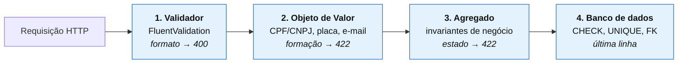

# Relatório de análise de vulnerabilidades

| | |
|---|---|
| **Sistema** | AutoMecanic — Sistema Integrado de Atendimento e Execução de Serviços |
| **Versão analisada** | 1.0.0 |
| **Data da análise** | 28 de agosto de 2026 |
| **Escopo** | Código-fonte, dependências (diretas e transitivas), imagem de contêiner e configuração |
| **Resultado** | **0 vulnerabilidades CRÍTICAS · 0 ALTAS · 4 MÉDIAS · 6 BAIXAS** — todas em pacotes do sistema operacional base, com correção disponível a montante |

---

## 1. Sumário executivo

A análise combinou quatro frentes: varredura de dependências .NET, varredura da imagem de
contêiner, revisão manual do código contra o OWASP API Security Top 10 e verificação de
segredos no repositório.

**Nenhuma vulnerabilidade foi encontrada no código da aplicação nem em suas dependências.**
As 10 ocorrências identificadas estão em pacotes do sistema operacional que compõem a imagem
base oficial da Microsoft, todas de severidade média ou baixa, e todas resolvidas por uma
atualização da imagem base — sem alteração no código.

Ao longo do desenvolvimento, **três defeitos de segurança e robustez foram encontrados e
corrigidos pelos próprios testes automatizados**, documentados na seção 6.

### Resultado consolidado

| Frente | Ferramenta | Crítica | Alta | Média | Baixa |
|---|---|:---:|:---:|:---:|:---:|
| Dependências .NET (diretas e transitivas) | `dotnet list package --vulnerable` | 0 | 0 | 0 | 0 |
| Runtime .NET dentro da imagem | Trivy 0.74 | 0 | 0 | 0 | 0 |
| Pacotes do sistema operacional | Trivy 0.74 | 0 | 0 | **4** | **6** |
| Segredos no repositório e na imagem | Trivy `--scanners secret` + `git grep` | 0 | 0 | 0 | 0 |
| Configuração da imagem | Trivy `--scanners misconfig` | 0 | 0 | 0 | 0 |
| **Total** | | **0** | **0** | **4** | **6** |

---

## 2. Varredura de dependências

### Comando e resultado

```bash
dotnet list package --vulnerable --include-transitive
```

```
O projeto fornecido `AutoMecanic.Api` não tem nenhum pacote vulnerável.
O projeto fornecido `AutoMecanic.Application` não tem nenhum pacote vulnerável.
O projeto fornecido `AutoMecanic.Domain` não tem nenhum pacote vulnerável.
O projeto fornecido `AutoMecanic.Infrastructure` não tem nenhum pacote vulnerável.
O projeto fornecido `AutoMecanic.IntegrationTests` não tem nenhum pacote vulnerável.
O projeto fornecido `AutoMecanic.UnitTests` não tem nenhum pacote vulnerável.
```

### Pacotes depreciados

```bash
dotnet list package --deprecated
```

| Pacote | Projeto | Situação | Avaliação |
|---|---|---|---|
| `xunit` 2.9.3 | Ambos os projetos de teste | Marcado como *Legacy*; sucessor é `xunit.v3` | **Risco nulo em produção.** É dependência exclusiva de teste, não compilada nem distribuída na imagem. A migração para xUnit v3 está registrada como melhoria, sem urgência. |

**A superfície de dependências é deliberadamente enxuta.** A camada de Domínio — onde vivem
todas as regras de negócio — tem **zero pacotes NuGet**. Cada dependência adicionada ao
projeto é uma superfície de ataque a mais e uma atualização de segurança a acompanhar.

---

## 3. Varredura da imagem de contêiner

### Comando

```bash
docker run --rm -v /var/run/docker.sock:/var/run/docker.sock aquasec/trivy:latest \
  image --scanners vuln,secret,misconfig \
  --severity CRITICAL,HIGH,MEDIUM,LOW automecanic-api:1.0.0
```

### Resultado

```
automecanic-api:1.0.0 (ubuntu 24.04)
Total: 10 (LOW: 6, MEDIUM: 4, HIGH: 0, CRITICAL: 0)

aplicacao/AutoMecanic.Api.deps.json                          dotnet-core    0
Microsoft.AspNetCore.App/10.0.11/…deps.json                  dotnet-core    0
Microsoft.NETCore.App/10.0.11/…deps.json                     dotnet-core    0
```

### Detalhamento das 10 ocorrências

Todas concentradas em **dois pacotes**, que são o mesmo componente:

| Pacote | CVEs | Severidade | Versão instalada | Versão corrigida |
|---|---|---|---|---|
| `openssl` | CVE-2026-63072, CVE-2026-63076, CVE-2026-63074, CVE-2026-54874, CVE-2026-75803 | 4 MÉDIA · 6 BAIXA | `3.0.13-0ubuntu3.12` | `3.0.13-0ubuntu3.15` |
| `libssl3t64` | *(mesmas)* | — | `3.0.13-0ubuntu3.12` | `3.0.13-0ubuntu3.15` |

**Análise de exposição.** O OpenSSL é usado pelo runtime .NET para TLS. Na topologia entregue,
a API não termina TLS diretamente — o `docker-compose` expõe HTTP, e em produção um proxy
reverso (nginx, Traefik, balanceador da nuvem) faz a terminação. O consumo de OpenSSL pela
aplicação limita-se à conexão com o PostgreSQL na rede interna do Docker.

**Correção.** Reconstruir a imagem quando a Microsoft publicar a base atualizada:

```bash
docker compose build --pull --no-cache api
```

Nenhuma alteração de código é necessária. Como o `Dockerfile` referencia a *tag* móvel
`10.0-noble-chiseled`, a correção chega automaticamente na próxima reconstrução.

### Redução deliberada da superfície de ataque

A primeira versão da imagem usava `mcr.microsoft.com/dotnet/aspnet:10.0-noble` (Ubuntu
completo) com `curl` instalado para o *health check*. A varredura acusou **25 vulnerabilidades
MÉDIA** distribuídas por 12 pacotes.

A imagem passou a usar a variante **`chiseled`**, que contém o runtime .NET e praticamente
nada além dele — sem shell, sem gerenciador de pacotes, sem `perl`, `tar`, `util-linux` ou
`diffutils`.

| Métrica | `aspnet:10.0-noble` | `aspnet:10.0-noble-chiseled` | Variação |
|---|---:|---:|---:|
| Pacotes de sistema operacional | ~90 | **8** | **−91%** |
| Vulnerabilidades MÉDIA | 25 | **4** | **−84%** |
| Vulnerabilidades ALTA / CRÍTICA | 0 | **0** | — |
| Pacotes distintos afetados | 12 | **2** | **−83%** |
| Shell disponível a um atacante | `/bin/sh`, `/bin/bash` | **nenhum** | — |
| Gerenciador de pacotes | `apt` | **nenhum** | — |

O ganho vai além da contagem de CVEs: sem shell e sem gerenciador de pacotes, um atacante que
conseguisse execução de comandos no contêiner **não teria as ferramentas** para se movimentar,
baixar carga adicional ou explorar o ambiente.

**Contrapartida resolvida.** Sem shell, o `HEALTHCHECK` não pode ser um comando arbitrário. A
aplicação passou a implementar o modo sonda `--health-check`, que reexecuta o próprio binário
para consultar `/health/pronto` — sem introduzir nenhuma ferramenta externa
(`src/AutoMecanic.Api/VerificacaoDeSaudeDoContainer.cs`).

### Configuração da imagem

| Verificação | Situação |
|---|---|
| Executa como usuário sem privilégios | ✅ UID 1654, padrão da imagem *chiseled* |
| SDK ausente da imagem final | ✅ Build multiestágio; a imagem final não tem compilador |
| Segredos embutidos na imagem | ✅ Nenhum — Trivy `--scanners secret`: 0 ocorrências |
| Configuração incorreta | ✅ Trivy `--scanners misconfig`: 0 ocorrências |
| `no-new-privileges` | ✅ Declarado no `docker-compose.yml` |
| Banco exposto na rede | ✅ Publicado apenas em `127.0.0.1` |

---

## 4. Revisão contra o OWASP API Security Top 10 (2023)

### API1:2023 — Broken Object Level Authorization ✅

**Risco.** Um usuário acessar objetos de outro trocando o identificador na URL.

**Controles.**
- Todas as rotas administrativas exigem JWT válido; identificadores são `Guid` v7, não sequenciais.
- A consulta pública de acompanhamento exige **número da OS e documento do cliente juntos**, e o serviço confere se o documento corresponde ao cliente da OS:

```csharp
// Application/OrdensServico/ServicoDeOrdensServico.cs
if (ordem is null || cliente is null || cliente.Documento != documento)
{
    throw new RecursoNaoEncontradoException(
        "Nenhuma Ordem de Serviço foi encontrada para o número e documento informados.");
}
```

- A resposta é **idêntica** para "OS inexistente" e "documento não confere". Diferenciá-las permitiria enumerar números de OS válidos.

**Testes.** `Acompanhamento_ComDocumentoDeOutroCliente_Responde404` (integração) e
`AcompanharAsync_ComDocumentoDeOutroCliente_NaoRevelaAExistenciaDaOrdem` (unitário).

---

### API2:2023 — Broken Authentication ✅

| Controle | Implementação |
|---|---|
| Hash de senha | **BCrypt com fator de custo 12** (~250 ms por verificação). Salt por hash, gerado pela biblioteca |
| Política de senha | Mínimo 8 caracteres, com maiúscula, minúscula, dígito e símbolo — validada **no domínio** |
| Proteção a força bruta | Bloqueio de 15 minutos após 5 tentativas malsucedidas consecutivas |
| Enumeração de contas | Resposta idêntica para e-mail inexistente e senha incorreta |
| Limite de taxa | 10 tentativas de login por minuto por endereço de origem |
| Expiração do token | 60 minutos, com `ClockSkew = TimeSpan.Zero` |
| Validação do token | Emissor, audiência, assinatura e validade — todos obrigatórios |
| Chave de assinatura | **Sem valor padrão.** A aplicação recusa iniciar sem uma chave de 32+ caracteres |

```csharp
// Program.cs — falha rápida, e com mensagem clara
if (string.IsNullOrWhiteSpace(opcoesDeJwt.ChaveDeAssinatura)
    || opcoesDeJwt.ChaveDeAssinatura.Length < OpcoesDeJwt.ComprimentoMinimoDaChave)
{
    throw new InvalidOperationException(
        "A chave de assinatura JWT deve ter no mínimo 32 caracteres. "
        + "Configure a variável de ambiente Jwt__ChaveDeAssinatura com um segredo forte.");
}
```

Uma chave embutida no código seria pública no repositório e permitiria a qualquer pessoa
forjar tokens de administrador.

**Testes.** `ContaBloqueiaAposCincoTentativasMalsucedidas`,
`Login_ComEmailInexistenteOuSenhaErrada_RespondeIgual`,
`RotaAdministrativa_ComTokenForjado_Responde401`, mais 8 testes unitários de BCrypt.

---

### API3:2023 — Broken Object Property Level Authorization ✅

**Risco.** A API devolver campos que o cliente não deveria ver (*excessive data exposure*), ou
aceitar campos que ele não deveria alterar (*mass assignment*).

**Controles.**
- **Nenhum agregado é serializado diretamente.** Toda resposta passa por um DTO explícito. O hash da senha não existe em `UsuarioResponse` — não é "escondido", simplesmente não está lá.
- Contratos de entrada são `record`s com exatamente os campos alteráveis. Não há como "colar" `Ativo` ou `Id` em um corpo de requisição, porque o tipo não tem esses membros.
- Campos imutáveis por regra de negócio ficam fora dos contratos de atualização: `AtualizarClienteRequest` não tem documento, `AtualizarVeiculoRequest` não tem placa.
- A visão pública de acompanhamento é reduzida: sem responsável técnico, sem custo individual de peça, sem identificadores internos. O orçamento só aparece **depois de enviado** ao cliente.

**Testes.** `RespostasDeUsuario_NuncaExpoemOHashDaSenha`,
`AcompanharAsync_ComOrcamentoEmElaboracao_NaoExpoeOValor`,
`acompanhamento nao expoe dados internos`.

---

### API4:2023 — Unrestricted Resource Consumption ✅

| Controle | Valor |
|---|---|
| Limite global de taxa | 300 requisições/minuto por endereço |
| Limite no login | 10 requisições/minuto por endereço |
| Tamanho máximo de página | **100 itens**, imposto no próprio tipo `ParametrosDePaginacao` |
| Tamanho de campos de texto | Limitado no domínio e no esquema do banco |
| Repetição em falha transitória | Máximo 3 tentativas, com atraso |
| Cancelamento cooperativo | `CancellationToken` propagado até a consulta ao banco |

O limite de paginação é imposto pelo tipo, não pela consulta — o cliente pode pedir
`tamanhoPagina=100000`, mas recebe 100:

```csharp
public int TamanhoPagina
{
    get => _tamanhoPagina;
    init => _tamanhoPagina = value switch
    {
        < 1 => TamanhoPadraoDePagina,
        > TamanhoMaximoDePagina => TamanhoMaximoDePagina,
        _ => value
    };
}
```

**Teste.** `Paginacao_LimitaOTamanhoDePaginaMesmoQuandoOClientePedeMais`.

---

### API5:2023 — Broken Function Level Authorization ✅

Autorização por **política nomeada pela capacidade de negócio**, não pelo cargo:

| Política | Perfis autorizados | O que permite |
|---|---|---|
| `Administrar` | Administrador | Gerenciar usuários e catálogos |
| `Atender` | Administrador, Atendente | Abrir OS, enviar orçamento, entregar veículo |
| `ExecutarServico` | Administrador, Mecânico | Diagnosticar, compor a OS, finalizar |
| `GerenciarEstoque` | Administrador, Estoquista | Movimentar peças e insumos |
| `Consultar` | Todos os autenticados | Leitura operacional |

> ⚠️ **Um defeito real desta categoria foi encontrado e corrigido.** Ver seção 6, item 6.1.

**Testes.** `PerfilMecanico_NaoPodeGerenciarUsuarios`,
`RotasAdministrativas_SemToken_Respondem401` (7 rotas).

---

### API6:2023 — Unrestricted Access to Sensitive Business Flows ✅

Os fluxos sensíveis são protegidos por **regras de domínio**, não apenas por permissão:

- A execução só começa com orçamento **aprovado** — não há endpoint que atribua status.
- Após o envio do orçamento, os itens ficam **congelados**: é impossível alterar o valor que o cliente aprovou.
- O cancelamento é recusado após a aprovação, quando peças já saíram do estoque.
- Estoque não pode ser prometido duas vezes (modelo de reserva).
- Ajuste de inventário não pode deixar o saldo abaixo do já reservado.

Essas regras vivem nos agregados e valem por **qualquer** caminho de execução — incluindo um
futuro consumidor de fila ou uma rotina interna que não passe pela API.

---

### API7:2023 — Server Side Request Forgery ✅

A aplicação **não faz requisições HTTP a URLs fornecidas pelo usuário**. O único cliente HTTP
existente é a sonda de saúde, que aponta para `localhost` em endereço fixo.

---

### API8:2023 — Security Misconfiguration ✅

| Controle | Implementação |
|---|---|
| Cabeçalhos de segurança | `X-Content-Type-Options`, `X-Frame-Options`, `Referrer-Policy`, `Permissions-Policy` |
| Impressão digital do servidor | `Server`, `X-Powered-By` e `X-AspNet-Version` removidos |
| HSTS e redirecionamento HTTPS | Ativos fora de desenvolvimento |
| CORS | Lista explícita de origens; **sem origens configuradas, nenhuma é liberada**. Curinga com credenciais é impossível |
| Detalhe de exceção | Mensagem genérica em produção; pilha de chamadas só no log do servidor |
| Segredos | Exclusivamente por variável de ambiente; `.env` no `.gitignore` |
| Superfície do contêiner | Imagem *chiseled*, usuário sem privilégios, `no-new-privileges` |

> **Nota sobre o cabeçalho `Server`.** A primeira implementação removia o cabeçalho em um
> middleware, mas o Kestrel o escreve no momento do *flush*, depois de qualquer middleware —
> e ele continuava aparecendo. A correção foi desligá-lo na origem
> (`builder.WebHost.ConfigureKestrel(o => o.AddServerHeader = false)`). **Encontrado por
> teste ponta a ponta**, não por leitura de código.

**Testes.** `CabecalhosDeSeguranca_EstaoPresentesEmTodaResposta`,
`RespostaDeErro_NaoVazaPilhaDeChamadasNemDetalhesInternos`.

---

### API9:2023 — Improper Inventory Management ✅

- API versionada no caminho (`/api/v1/...`).
- OpenAPI completo e sempre sincronizado — gerado dos próprios atributos e comentários XML.
- Ambientes separados por configuração, sem valores de produção no código.
- Um único `Directory.Packages.props` centraliza todas as versões de dependência, tornando o inventário verificável em um arquivo.

---

### API10:2023 — Unsafe Consumption of APIs ✅

O sistema **não consome APIs de terceiros** neste MVP. A seção do
[Context Map](03-context-map.md#camada-anticorrupção--onde-ainda-não-existe) registra que
integrações futuras (NF-e, gateway de pagamento, catálogo de fornecedor) exigirão uma **Camada
Anticorrupção** — inclusive para validar e sanear o que vier de fora.

---

## 5. Controles adicionais

### Injeção de SQL — não aplicável por construção

Todo acesso a dados passa por LINQ traduzido pelo EF Core, com parametrização automática.
O **único comando SQL escrito à mão** no sistema é a alocação do número da OS, e ele é
parametrizado:

```csharp
comando.CommandText = ComandoDeAlocacao;         // texto constante, sem interpolação
comando.Parameters.Add(new NpgsqlParameter("ano", ano));
```

A busca textual usa `EF.Functions.ILike` com o termo **parametrizado pelo EF** — não há
concatenação de string em nenhum ponto do acesso a dados.

### Validação de entrada em três camadas



A redundância é intencional. O validador melhora a mensagem devolvida ao cliente; o objeto de
valor garante que **nenhum dado inválido existe em memória, nem vindo do banco**; o agregado
garante que nenhum caminho de código produz estado inválido; e o banco continua valendo mesmo
para quem alterar dados por SQL direto.

### Concorrência

Controle otimista via `xmin` do PostgreSQL em todas as raízes de agregado. Duas alterações
concorrentes no mesmo registro não se sobrescrevem silenciosamente: a segunda falha e recebe
**409** com instrução de recarregar.

### Auditoria

| Registro | Onde |
|---|---|
| Toda transição de status da OS, com autor e momento | `HistoricoStatus` |
| Toda movimentação de estoque, com saldo antes e depois | `MovimentoEstoque` (append-only) |
| Login bem-sucedido, bloqueio e troca de senha | Eventos de domínio + log |
| Requisições, com correlação | Serilog estruturado |

### Segredos

| Verificação | Resultado |
|---|---|
| `.env` versionado | ❌ Não (corretamente ignorado) |
| Segredos em arquivos versionados | Nenhum |
| Chaves privadas ou certificados no repositório | Nenhum |
| Segredos embutidos na imagem | Nenhum (Trivy: 0) |
| `TODO` / `FIXME` / `HACK` pendentes no código | 0 |

O `.env.example` traz **apenas espaços reservados**, com instrução de geração:

```bash
# Gere uma nova com:  openssl rand -base64 48
JWT_CHAVE=troque-esta-chave-por-um-segredo-aleatorio-de-32-caracteres-ou-mais
```

---

## 6. Defeitos encontrados e corrigidos durante o desenvolvimento

Os três defeitos abaixo foram encontrados por **testes automatizados**, não por revisão de
código — o que é o argumento mais concreto a favor de testar contra a infraestrutura real.

### 6.1 · Autoatendimento inacessível a perfis não administrativos 🔴 **Alta**

| | |
|---|---|
| **Categoria** | OWASP API5 — Broken Function Level Authorization |
| **Descoberto por** | `Usuarios_TrocaDaPropriaSenha_ExigeASenhaAtual` (integração) |
| **Sintoma** | Qualquer usuário que não fosse Administrador recebia **403** ao tentar trocar a própria senha ou ver o próprio perfil |

**Causa raiz.** `GET /usuarios/eu` e `POST /usuarios/eu/senha` estavam em `UsuariosController`,
cuja classe declara `[Authorize(Policy = Administrar)]`, com um `[Authorize(Policy = Consultar)]`
mais permissivo na ação. O ASP.NET Core **combina** os atributos de classe e ação exigindo que
**ambas** as políticas passem — a política da ação nunca é alcançada.

**Impacto.** Atendentes, mecânicos e estoquistas ficavam **impedidos de trocar a própria
senha**, o que na prática obrigaria a compartilhar credenciais ou depender de redefinição
administrativa a cada troca. Uma degradação real de postura de segurança.

**Correção.** As duas ações passaram para `MeuPerfilController`, com política própria. O
motivo está documentado no código para que a estrutura não seja "simplificada" de volta.

---

### 6.2 · Cabeçalho `Server` continuava sendo enviado 🟡 **Baixa**

| | |
|---|---|
| **Categoria** | OWASP API8 — Security Misconfiguration |
| **Descoberto por** | Teste ponta a ponta contra o contêiner |
| **Sintoma** | O middleware removia o cabeçalho, mas ele continuava presente na resposta |

**Causa raiz.** O Kestrel escreve `Server: Kestrel` no momento do *flush* dos cabeçalhos,
depois da execução de qualquer middleware. Remover em `OnStarting` era cedo demais.

**Impacto.** Divulgação da tecnologia do servidor, facilitando a seleção de exploits conhecidos.

**Correção.** `builder.WebHost.ConfigureKestrel(o => o.AddServerHeader = false)`.

---

### 6.3 · Falha total de operações monetárias em imagem sem ICU 🔴 **Alta (disponibilidade)**

| | |
|---|---|
| **Categoria** | Robustez / disponibilidade |
| **Descoberto por** | Teste ponta a ponta após a migração para imagem *chiseled* |
| **Sintoma** | `500 Erro interno` em qualquer operação que envolvesse valores |

**Causa raiz.** `Dinheiro` mantinha um `CultureInfo.GetCultureInfo("pt-BR")` estático. Imagens
mínimas não incluem a biblioteca ICU, e nelas o .NET roda em modo globalização-invariante — a
busca por cultura lança `CultureNotFoundException`. Por ser inicialização de tipo estático, o
erro derrubava **toda** operação que tocasse `Dinheiro`.

**Impacto.** Indisponibilidade completa dos fluxos de orçamento na imagem endurecida.

**Correção.** O formato monetário passou a ser declarado explicitamente com `NumberFormatInfo`,
sem consultar a tabela de culturas do sistema. Além de resolver o defeito, isso torna real a
promessa de que a camada de Domínio não depende de nada externo.

---

## 7. Recomendações

### Antes de ir a produção

| # | Recomendação | Motivo |
|---|---|---|
| 1 | Reconstruir a imagem com `--pull` periodicamente | Traz as correções de OpenSSL da seção 3 |
| 2 | Terminar TLS em proxy reverso, com certificado válido | O JWT trafega no cabeçalho; sem TLS, é interceptável |
| 3 | Mover os segredos do `.env` para um cofre gerenciado | `.env` em disco é aceitável para avaliação, não para produção |
| 4 | Trocar migração automática por *job* de implantação | Múltiplas réplicas migrando juntas causam conflito |
| 5 | Configurar `Cors:OrigensPermitidas` com o domínio real | Hoje, sem configuração, nenhuma origem é liberada |
| 6 | Agendar `POST /ordens-servico/manutencao/expirar-orcamentos` | Sem isso, reservas de orçamentos abandonados prendem estoque |

### Melhorias de médio prazo

| # | Melhoria | Ganho |
|---|---|---|
| 7 | Token de renovação (*refresh token*) com revogação | Permite expirar a sessão em 15 min sem prejudicar a experiência |
| 8 | Segundo fator para o perfil Administrador | Protege a conta de maior impacto |
| 9 | Trivy e `dotnet list package --vulnerable` na integração contínua | Impede regressão de dependência vulnerável |
| 10 | Migrar de xUnit v2 para v3 | Elimina o único pacote depreciado |
| 11 | Log de auditoria em tabela dedicada | Hoje a trilha está em log estruturado, mais difícil de consultar |
| 12 | Alerta de estoque via fila em vez de log | Notificação real ao setor de compras |

---

## 8. Como reproduzir esta análise

```bash
# 1. Dependências .NET (diretas e transitivas)
dotnet list package --vulnerable --include-transitive
dotnet list package --deprecated

# 2. Imagem de contêiner — vulnerabilidades, segredos e configuração
docker compose build api
docker run --rm -v /var/run/docker.sock:/var/run/docker.sock aquasec/trivy:latest \
  image --scanners vuln,secret,misconfig \
  --severity CRITICAL,HIGH,MEDIUM,LOW automecanic-api:1.0.0

# 3. Segredos no repositório
git ls-files | grep -iE "\.(pem|key|pfx|p12|crt)$"
git grep -nE "(password|senha|secret|apikey|token)\s*=\s*[\"'][^\"']{8,}" -- '*.cs' '*.json' '*.yml'

# 4. Testes de segurança automatizados
dotnet test --filter "FullyQualifiedName~Seguranca"
```

---

## 9. Conclusão

O sistema **não apresenta vulnerabilidades críticas ou altas**. As 10 ocorrências identificadas
estão em um único componente do sistema operacional base (OpenSSL), são de severidade média e
baixa, e se resolvem com uma atualização da imagem base — sem alteração de código.

Os controles exigidos pelo requisito estão implementados e **verificados por testes
automatizados**: autenticação JWT nas APIs administrativas, validação de CPF/CNPJ e placa com
dígito verificador, e 486 testes cobrindo 92,2% do código.

O ponto que mais merece registro não é a ausência de achados na varredura, e sim que os
**três defeitos reais de segurança e robustez foram encontrados pelos próprios testes** — em
particular o de autorização (6.1), que nenhuma ferramenta de varredura detectaria e que uma
revisão de código provavelmente também não pegaria.

---

**Voltar ao [índice da documentação](00-visao-geral.md).**
